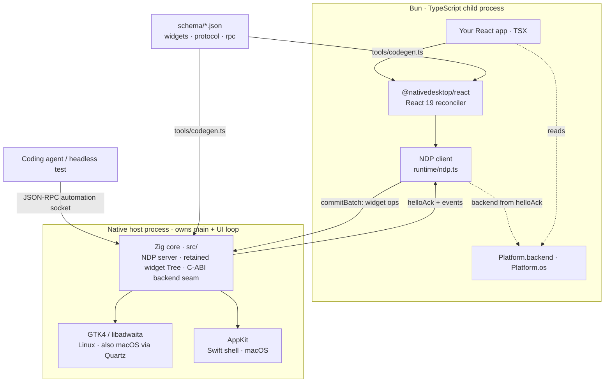

# NativeDesktop

Write React 19 in TypeScript, get real native desktop widgets: GTK4 and libadwaita on Linux, AppKit
on macOS. No DOM, no Electron, no browser on the UI path.

The widgets your JSX describes are the platform's own classes (`GtkBox`, `AdwHeaderBar`, `NSButton`,
`NSSplitView`), so one React tree renders in each platform's current design language rather than a
lookalike layer approximating both. Apps that need web content get a `<webview>` backed by the
system engine (WKWebView on macOS, WebKitGTK on Linux) with native UI around it.

```tsx
// src/main.tsx
import { render, useState } from "@nativedesktop/react";

function App() {
  const [clicks, setClicks] = useState(0);

  return (
    <window title="Counter" defaultWidth={480} defaultHeight={320}>
      <box orientation="vertical" spacing={8}>
        <label text={`Clicks: ${clicks}`} />
        <button label="Increment" onClick={() => setClicks((c) => c + 1)} />
      </box>
    </window>
  );
}

await render(<App />);
```

Hooks are imported from `@nativedesktop/react`, not from `react`. Hot reload re-evaluates the whole
module graph, and a bare `react` import resolves to a fresh instance with no attached dispatcher.
Shared logic packages are the exception: write them against `react` and the build rewrites the
import for you. See [State & Hot Reload][state] and [Monorepo & Code Sharing][monorepo].

## Getting started

Install from npm. The host binary ships prebuilt for macOS on Apple silicon and x86_64 Linux; on
Linux the system needs GTK4 and libadwaita at run time, see [Requirements](docs/runtime-deps.md):

```bash
bun add @nativedesktop/cli @nativedesktop/react react
bunx nd dev src/main.tsx
```

### Working on the framework

You need Zig 0.16.0, Bun 1.3.13, and on Linux GTK4 plus libadwaita. The repo pins all of it in a Nix
flake:

```bash
nix develop
```

On macOS, nixpkgs' `libadwaita` fails to build (an `appstream` dependency issue), so the Mac devshell
borrows Homebrew's GTK stack. Run `brew install libadwaita` once, which pulls in `gtk4` too.

Scaffold an app and run it:

```bash
./scripts/new-app.sh ../my-app
cd ../my-app
bun install
bun run dev
```

`bun run dev` is `nd dev`, which runs the native backend for your platform: the AppKit shell on
macOS, the GTK host on Linux. It resolves that binary through `@nativedesktop/host` and, inside this
checkout, builds it on first run. Hot reload and the crash-restart overlay are on.

To see the same tree on the other backend, GTK4 also runs on macOS through its Quartz `gdk`:

```bash
bun run dev -- --backend gtk
```

The framework's own examples run the same way. `cd examples/counter && bun run dev` is the shortest
path to a real window.

### The `nd` CLI

| Command | What it does |
|---|---|
| `nd dev [entry]` | Run in dev mode: `ND_DEV=1`, hot reload, crash-restart overlay. `entry` defaults to `src/main.tsx`. |
| `nd dev --backend gtk\|appkit` | Force a backend. Defaults to AppKit on macOS, GTK elsewhere. Also reads `ND_BACKEND`. |
| `nd build` | Compile the app to `dist/` through Babel (React Compiler pass, JSX to calls, hook-import rewrite). |

`nd` wraps environment variables the host reads directly. `ND_SCRIPT` points at the React entry,
`ND_DEV=1` enables hot reload, `NATIVE_AUTOMATION=1` opens the automation socket (`nd dev` does not
set this one for you), and `NDP_TRACE=1` logs every protocol frame.

## How it works

Every app is two processes.



The **native host** owns `main()` and the platform's UI loop: GLib's main loop on Linux,
`NSApplication.run` through a thin Swift shell on macOS. Both sit on the same GTK-free Zig core in
`src/`, which holds the NDP server, the authoritative retained widget tree, and a frozen C-ABI seam
that the platform widget layer plugs into.

The **Bun/TypeScript child** runs your app. Components never touch a widget. React's reconciler
diffs the tree and ships the result over NDP, a length-prefixed JSON protocol on a local socket, as
one `CommitBatch` per commit. Events come back the same way.

Because the two are separate processes, a JS crash or hang leaves the window standing. The host
stays up, keeps answering automation requests, and can restart the child. A crash inside the native
toolkit is the one failure mode this does not isolate, which is also true of any native app.

Unlike an Electron renderer, the child is a full Bun runtime with `node:fs`, `bun:sqlite`, process
spawning, and network access. There is no `contextBridge` and no separate backend process to talk
to. The tradeoff: heavy synchronous work on the Bun main thread stalls React's commit loop, so
push it off with `@nativedesktop/data` or a `Worker`.

### Schemas generate the boundary

Three JSON schemas feed `tools/codegen.ts` and are the only source of truth for anything crossing
the Zig/Bun line:

- `schema/widgets.json`: 53 widgets with their props, defaults, events, commands, and automation
  role. Generates the Zig bindings, TypeScript intrinsics, Swift bindings, and the widget reference.
- `schema/protocol.json`: the 14 NDP frames (`hello`, `commitBatch`, `event`, `systemRequest`, and
  the rest).
- `schema/rpc.json`: 13 automation methods with typed params, results, and error codes, generated
  into a tRPC-style client where `AutomationClient.call<M>()` returns `Promise<RpcResult<M>>`.

Rename or retype a field and both the Zig and the TypeScript side fail to compile. Never hand-edit
generated files. Run `scripts/regen-bindings.sh` after a schema change.

## What you get

**Native chrome, not a facsimile.** Header bars, sidebars, split views, and toolbars are the real
widgets. `style` covers theme-neutral geometry; `cssClasses` reaches named design-language classes
that map to GTK CSS on Linux and real AppKit control properties on macOS. Dark mode follows the
system. See [Styling & Design Language][styling] and [Windows & Chrome][chrome].

**Automation as a first-class consumer.** Set `NATIVE_AUTOMATION=1` and every widget in the tree is
inspectable and drivable over a JSON-RPC socket. `getTree` returns an accessibility tree with roles,
enabled and focused state, and live values. On macOS, `pointer`, `drag`, and `keys` post real
NSEvents through the app's queue. A coding agent drives the app the way a person would. See
[Automation Socket][automation] and [MCP Tools][mcp].

**Multiple windows and native tabs.** Render more than one `<window>` root and each becomes an
independent OS window, all from the same React process, so they share state without IPC. Adding
`tabGroup` turns them into the platform's own tab system: `addTabbedWindow` on macOS, `AdwTabView`
on GTK. Dragging a `<webview>` tab into another window keeps it alive rather than reloading it, via
`createPortal` plus `moveNode`. See [Multi-Window][multiwindow] and [Native Tabs][tabs].

**System capabilities.** Promise-based APIs for file dialogs, clipboard, notifications, recent
documents, Keychain and libsecret credentials, audio playback with a spectrum feed, and app-level
events like `onOpenUrl` and `onFileDrop`. Access is gated per method group by an ACL manifest. See
[System Capabilities][system].

**App data and SQLite.** `getAppDataDir()` resolves each OS's per-app directory.
`@nativedesktop/data` runs `bun:sqlite` inside a Bun `Worker`, so queries never block the thread
driving React. It depends on no ORM: `query`, `mutate`, and `transaction` form a stable
`SqliteExecutor` seam, with worked Drizzle and Kysely adapters in the tests. See
[App Data & Storage][data].

**App-owned native code.** An app can compile its own GTK widgets, AppKit views, or SwiftUI in an
`NSHostingView` into a `.so` or `.dylib`. The prebuilt host loads the plugin at launch and typed
React wrappers carry props, events, and commands across, with no framework rebuild. See
[App-owned native components](docs/native-components.md) and
[`examples/nativeview-demo`](examples/nativeview-demo).

**A `<terminal>` widget** backed by libghostty-vt, and a `<webview>` with the surface a browser
needs: navigation events, load progress, download interception, popup handling, and
`executeJavaScript`. See [Terminal][terminal] and [WebView][webview].

## Platform support

| Platform | Backend | Status |
|---|---|---|
| Linux | GTK4 + libadwaita | Shipping. Blocking CI gate: unit tests, codegen freshness, and headless drive scripts under Weston. |
| macOS | AppKit, a Swift shell over a GTK-free `libnd.a` | Shipping. Non-blocking CI job plus local drive scripts. |
| Windows | Win32 with Direct2D/DirectWrite and UIA providers | Designed, not implemented. `tools/package.ts` rejects it as a target. |

Mobile is out of scope by design. See [Platform Support][platform].

## Repository layout

```
src/              Zig core: NDP server, reconciler, ACL, C-ABI backend seam
src/gtk/          GTK4 + libadwaita backend, compiled into the Linux host
swift/            AppKit backend: NDShell (hand-written), NDGen (generated), CNd (bridges libnd.a)
schema/           widgets.json, protocol.json, rpc.json
tools/            codegen.ts, packaging, ndshot screenshot helper
packages/         react, nd (published as @nativedesktop/cli), host + host-<os>-<arch> binaries, data, native, mcp, babel-plugin-nativedesktop
examples/         13 runnable apps, from counter to a tabbed browser
runtime/          NDP client and its tests
plugins/          sample native plugins
scripts/          headless drive scripts, scaffolder, binding regeneration
docs-site/        the documentation site (Astro + Starlight)
template/         what scripts/new-app.sh copies
```

## Working on the framework

```bash
zig build                     # builds zig-out/bin/nd-hello, the GTK host
zig build test                # Zig unit tests
zig build libnd -Dbackend=abi # GTK-free static core the Swift shell links
scripts/regen-bindings.sh     # regenerate Zig/TS/Swift bindings from the schemas
```

Run a freshly built host directly when you are changing the host itself, since `nd dev` prefers the
resolved prebuilt binary:

```bash
ND_SCRIPT=examples/counter/main.tsx NATIVE_AUTOMATION=1 ./zig-out/bin/nd-hello
```

The host prints `ND_*` markers to stderr: `ND_CHILD_CONNECTED`, `ND_COMMIT_APPLIED commitId=…`,
`ND_AUTOMATION_LISTENING path=…`, `ND_CHILD_EXITED`. The `scripts/headless-*.sh` gates assert on
those markers, so capture stderr with `2>&1` when you drive the host yourself.

Building the macOS shell by hand takes one extra step, because Zig's archiver emits object members
Apple's linker rejects. [Quick Start][quickstart] has the `libtool` repack recipe and the
`env -u SDKROOT` invocation.

## Docs

The full site lives in [`docs-site/`](docs-site) and runs with `cd docs-site && bun install && bun
run dev`. Start with [Introduction][intro] and [Quick Start][quickstart].

[intro]: docs-site/src/content/docs/get-started/introduction.md
[quickstart]: docs-site/src/content/docs/get-started/quick-start.md
[monorepo]: docs-site/src/content/docs/get-started/monorepo.md
[state]: docs-site/src/content/docs/core-concepts/state-hot-reload.md
[styling]: docs-site/src/content/docs/core-concepts/styling-design-language.md
[data]: docs-site/src/content/docs/core-concepts/app-data-storage.md
[chrome]: docs-site/src/content/docs/native-platform/windows-chrome.md
[multiwindow]: docs-site/src/content/docs/native-platform/multi-window.md
[tabs]: docs-site/src/content/docs/native-platform/tabs.md
[system]: docs-site/src/content/docs/native-platform/system-capabilities.md
[platform]: docs-site/src/content/docs/native-platform/platform-support.md
[terminal]: docs-site/src/content/docs/components/terminal.md
[webview]: docs-site/src/content/docs/components/webview.md
[automation]: docs-site/src/content/docs/automation-testing/automation-socket.md
[mcp]: docs-site/src/content/docs/automation-testing/mcp-tools.md

## License

MIT, see [LICENSE](LICENSE). Third-party attributions, including the vendored
libghostty-vt archives and the dynamically linked LGPL GTK stack on Linux, are
in [NOTICE](NOTICE).
