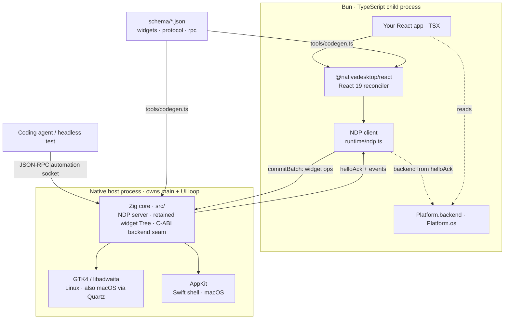

# NativeDesktop

NativeDesktop is a cross-platform desktop framework where you write React 19 in TypeScript and get
real native widgets back: GTK4/libadwaita on Linux, AppKit on macOS, Win32 planned. There is no
embedded browser on the UI path: no DOM, no Electron. Apps can still show web content — the
`<webview>` widget wraps the platform's own engine (WKWebView on macOS, WebKitGTK on Linux) while
the UI around it stays native. The widgets your JSX describes are the platform's own widget
classes (`GtkBox`, `AdwHeaderBar`, `NSButton`, `NSSplitView`), so one React tree renders in each
platform's current design language (Liquid Glass on macOS, Adwaita on GNOME) instead of a
facsimile layer approximating either one.

## Share code with web and React Native

`@nativedesktop/react` declares `react` as a `peerDependency` rather than a vendored copy, so a
NativeDesktop app can live in a monorepo next to a web (`react-dom`) app and a React Native app and
share a single hooks/logic package with both, unmodified. Author a hook the normal way,
`import { useState } from "react"`, in a plain `.ts` file, and NativeDesktop's build pipeline
rewrites that import to the pinned `@nativedesktop/react` for you (a Babel plugin for `nd build`, a
Bun `onLoad` plugin for `nd dev`/`bun --hot`). Desktop-only UI lives in `.desktop.tsx` files, the
platform-suffix convention React Native uses for `.native.tsx`. See
[Monorepo & Code Sharing](docs-site/src/content/docs/get-started/monorepo.md) for the full mechanics.

## Quickstart

Enter the pinned toolchain (Zig 0.16.0, Bun 1.3.13, and, on Linux, GTK4 + libadwaita) with
`nix develop`. On macOS, nixpkgs' `libadwaita` doesn't build under Nix (an `appstream` issue), so the
Mac devshell borrows Homebrew's GTK stack instead: run `brew install libadwaita` once (it pulls in
`gtk4` too). Then, inside that shell:

```bash
zig build                    # produces zig-out/bin/nd-hello, the Zig host
./scripts/new-app.sh ../my-app
cd ../my-app
bun install
bun run dev                   # == `nd dev` — ND_DEV=1, hot reload, crash-restart overlay
```

`bun run dev` resolves the *prebuilt* `nd-hello` binary for your platform via `@nativedesktop/host`.
Prebuilt binaries ship for `darwin-arm64` (`packages/host/bin/darwin-arm64/`). On other platforms,
run `zig build` and copy `zig-out/bin/nd-hello` into `packages/host/bin/<os>-<arch>/nd-hello` first
(see `packages/host/src/index.ts`). `nd dev [entry]` and `nd build` (`packages/nd`) wrap the
underlying mechanism directly:

```bash
ND_SCRIPT=src/main.tsx NATIVE_AUTOMATION=1 ./zig-out/bin/nd-hello
```

Running the host directly like this is useful while iterating on the Zig host itself, since
`nd dev` runs a prebuilt binary rather than a fresh build. `NATIVE_AUTOMATION=1` opens the
automation RPC socket (see below); `nd dev` doesn't set it for you.

## Architecture

Every NativeDesktop app is two processes:



- **A native host** owns `main()` and the platform's native UI loop (GLib's main loop on Linux via
  GTK4/libadwaita, `NSApplication.run` via a thin Swift shell on macOS). Both are the same GTK-free
  Zig core (`src/`): NDP server, retained widget tree, and a frozen C-ABI backend seam, with the
  platform-specific widget layer plugged in behind it. It holds the authoritative widget tree.
- **A Bun/TypeScript child** runs your React app. Your components never touch a widget directly.
  React's reconciler diffs your tree and sends the result to the host over **NDP**, a
  length-prefixed JSON protocol over a local socket, as one `CommitBatch` per commit.

This split means a JS crash or hang doesn't take the window down: the host stays up and keeps
answering automation requests.

**Know which backend is drawing.** The OS can't tell you (GTK runs on macOS too), so the host names
its active backend in the NDP handshake, and the child reads it as `Platform.backend` (`"gtk"` |
`"appkit"`) alongside `Platform.os`. Branch on `backend` for renderer quirks, on `os` for OS
conventions; `Platform.select({ gtk, appkit, default })` picks per backend. See
[Platform Support](docs-site/src/content/docs/native-platform/platform-support.md).

**App-owned native components.** Apps can compile GTK widgets, AppKit views, or SwiftUI hosted in
`NSHostingView` as their own `.so`/`.dylib`. The prebuilt host loads those plugins at launch, while
typed React wrappers carry JSON props, events, and commands without a framework rebuild. See
[App-owned native components](docs/native-components.md) and
[`examples/nativeview-demo`](examples/nativeview-demo).

**Schema-driven codegen.** Three schemas are the single source of truth
for everything that crosses the Zig↔Bun boundary, all fed through `tools/codegen.ts`:

- `schema/widgets.json` — every widget's props, defaults, events, and automation role. Generates the
  Zig bindings, TypeScript intrinsics, Swift bindings for the AppKit backend, and the widget
  reference docs.
- `schema/protocol.json` — the NDP wire frames (`hello`, `commitBatch`, `event`, …).
- `schema/rpc.json` — the automation RPC router: 7 methods (`getTree`, `screenshot`, `click`,
  `waitFor`, `setValue`, `type`, `scroll`) with typed params/results and error codes, generated into
  a fully-typed, tRPC-style client (`AutomationClient.call<M>(): Promise<RpcResult<M>>`).

Renaming or retyping a field in any of these schemas is a compile error on both the Zig side and the
TypeScript side, so a mismatch fails at build time instead of at runtime.

**Automation-first.** Every widget a React tree creates is tracked host-side and answerable over a
JSON-RPC socket the moment `NATIVE_AUTOMATION=1` is set. A coding agent or a headless test drives
the app the same way a user would.

**Multi-window, with widget-preserving reparenting.** Render more than one `<window>` root and each
becomes an independent OS window, all driven by the same Bun/React process, so windows share state
without IPC. Moving a live widget (e.g. a `<webview>` tab) to another window without
reloading it is a dedicated primitive, `createPortal` + `moveNode`, since a plain React re-parent
would unmount and rebuild the native widget. See
[Multi-Window](docs-site/src/content/docs/native-platform/multi-window.md).

**App data directory and a worker-backed SQLite layer.** `getAppDataDir()`/`ensureAppDataDir()`
resolve each OS's own per-app data directory; `@nativedesktop/data` runs `bun:sqlite` inside a Bun
`Worker` so queries never block the thread driving React's commit loop. It depends on no ORM:
`query`/`mutate`/`transaction` (the `SqliteExecutor` interface) is a stable seam any ORM can adapt
to in userland, with worked Drizzle and Kysely examples. See
[App Data & Storage](docs-site/src/content/docs/core-concepts/app-data-storage.md).

**A broad widget set, plus native dialogs and toasts.** Beyond the form/layout basics, NativeDesktop
ships pickers (color, date, font), menus/popovers, Table and TreeView for structured data, Video, and
macOS-only polish widgets (`<trayitem>`, `<sharebutton>`) gated with `Platform.os`. Per-window native
dialogs (`showAlert`/`openFile`/`saveFile`/`showAbout`) and in-app toasts (`showToast`/`dismissToast`
on a `<toastoverlay>`) round out the app-facing surface. See the
[Widget Reference](docs-site/src/content/docs/components/widget-reference.md) and
[Dialogs](docs-site/src/content/docs/components/dialogs.md).

## Docs

The full documentation site lives in [`docs-site/`](docs-site) (Astro + Starlight). Run it locally:

```bash
cd docs-site && bun install && bun run dev
```

Start with [Introduction](docs-site/src/content/docs/get-started/introduction.md) and
[Quick Start](docs-site/src/content/docs/get-started/quick-start.md).
