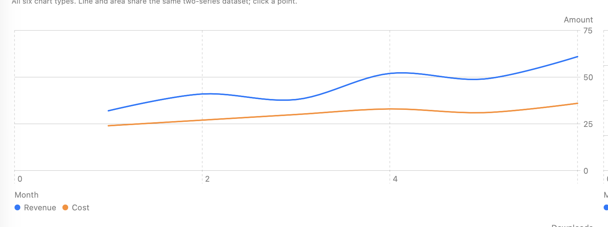
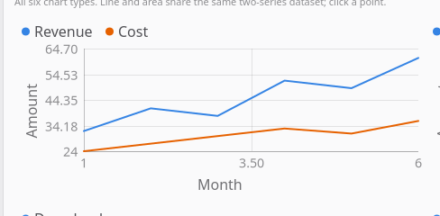
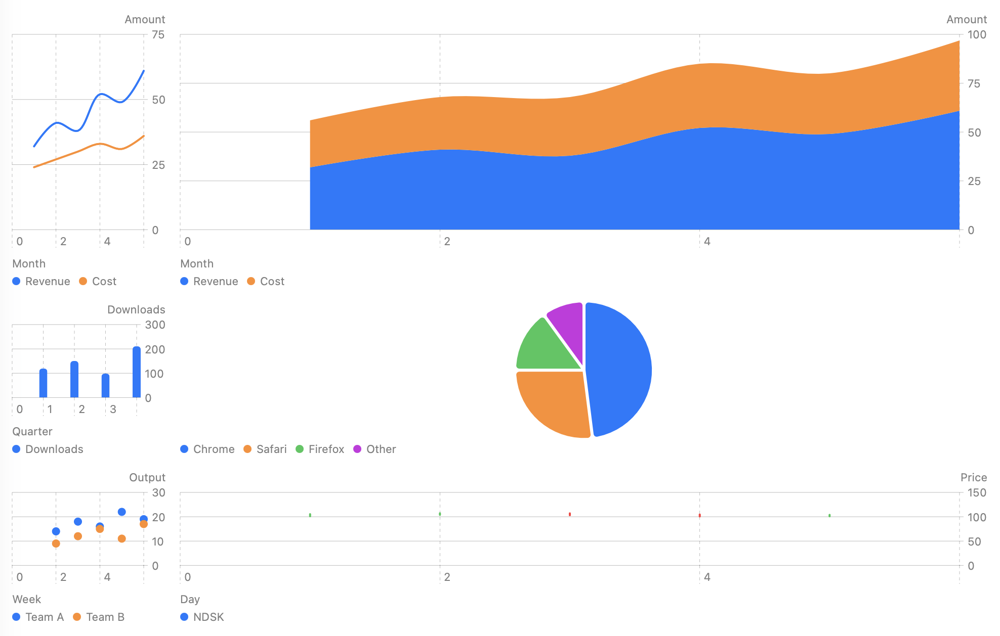
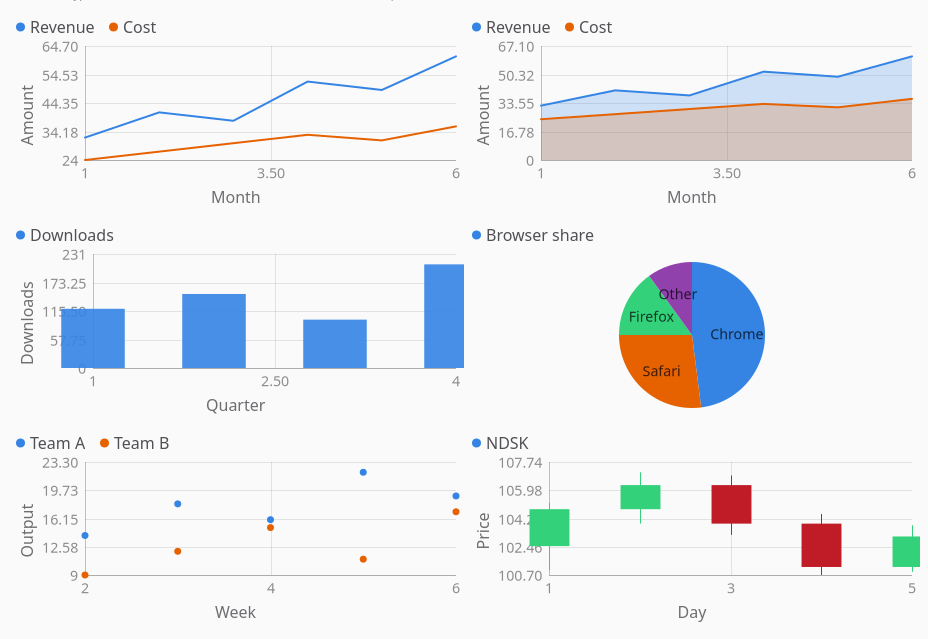

`<chart>` plots one or more data series as line, area, bar, pie, scatter, or candlestick. macOS
renders through Swift Charts in an `NSHostingView`, the framework GNOME apps use for charting.
GTK has no equivalent library, so the GTK backend draws the same six types itself onto a
`GtkDrawingArea` with Cairo.





```tsx
const trend = [
  { id: "revenue", label: "Revenue", points: [
    { x: 1, y: 32 }, { x: 2, y: 41 }, { x: 3, y: 38 }, { x: 4, y: 52 },
  ] },
  { id: "cost", label: "Cost", points: [
    { x: 1, y: 24 }, { x: 2, y: 27 }, { x: 3, y: 30 }, { x: 4, y: 33 },
  ] },
];

<chart
  type="line"
  series={trend}
  xLabel="Month"
  yLabel="Amount"
  onPointSelected={(e) => {
    const { seriesId, index, x, y } = e.data as { seriesId: string; index: number; x: number; y: number };
    console.log(`${seriesId} point ${index}: (${x}, ${y})`);
  }}
/>;
```

## Data shape

```ts
interface ChartPoint {
  x: number;
  y: number;
  label?: string;
  open?: number;
  high?: number;
  low?: number;
  close?: number;
}

interface ChartSeries {
  id: string;
  label: string;
  color?: string;
  points: ChartPoint[];
}
```

`x`/`y` are the numeric axes. `label` names the point on a category axis (bar's tick labels) and
names the slice on a pie. `open`/`high`/`low`/`close` carry a candlestick's body and wick and are
ignored by every other chart type, which read `y` instead.

`id` is echoed back in `pointSelected`. `label` is the legend entry. `color` is an explicit
`#rrggbb`; leave it unset and the series takes the next slot of the platform's accent-seeded
palette. The widget never sorts, filters, or rewrites `points`. The app owns the data, the same
contract as `<table>`'s `rows`.

`ChartSeries` and `ChartPoint` are re-exported from `@nativedesktop/react`, so import them
directly rather than relying on structural typing:

```ts
import type { ChartPoint, ChartSeries } from "@nativedesktop/react";
```

## Props

| Prop | Type | Applied | Notes |
| --- | --- | --- | --- |
| `type` | `"line"` \| `"area"` \| `"bar"` \| `"pie"` \| `"scatter"` \| `"candlestick"` | createAndUpdate | Default `"line"`. |
| `series` | `ChartSeries[]` | createAndUpdate | No default. An empty array renders an empty plot. |
| `xLabel` | string | createAndUpdate | Axis title. Default `""` (no label). Unused by pie. |
| `yLabel` | string | createAndUpdate | Axis title. Default `""` (no label). Unused by pie. |
| `showLegend` | bool | createAndUpdate | Default `true`. |
| `showGrid` | bool | createAndUpdate | Default `true`. Unused by pie, which has no axes to grid. |
| `animated` | bool | createAndUpdate | Default `true`. The OS reduce-motion setting outranks this prop, the same rule `<skeleton>` follows. |

## Events

| Event | Handler | Payload |
| --- | --- | --- |
| `pointSelected` | `onPointSelected` | `{ data: { seriesId, seriesIndex, index, x, y } }` |

Fires when the user clicks or taps the nearest point, within a small hit radius (24px on both
backends). A candlestick point hit-tests against its `close` price rather than `y` on both
backends.

## Chart types





- **line** – one connected line per series, drawn with a smooth (Catmull-Rom) interpolation.
- **area** – the same line, filled down to the axis.
- **bar** – grouped bars per series at each `x`.
- **pie** – reads only `series[0]`. Each point becomes one slice: `label` names it, `abs(y)` sizes
  it. A second series would be a second angular scale on the same plot, which isn't a pie, so it's
  ignored.
- **scatter** – unconnected points per series, no line between them.
- **candlestick** – reads `open`/`high`/`low`/`close` per point: a wick spans `low`…`high`, a body
  spans `open`…`close`. The body/wick colour is the series' `color` if set, otherwise the system
  green/red up/down convention (green when `close >= open`).

## Platform notes

- **Colour.** Series slot 0 takes the live system accent color; the rest walk a fixed system-colour
  ramp (orange, green, purple, yellow, red, brown on macOS). A series' explicit `color` overrides
  its slot. Candlesticks ignore the ramp and use the up/down convention unless `color` is set.
- **Theme.** Both backends read colours at draw/render time rather than caching them, so an accent
  or light/dark switch repaints every live chart without an app re-render.
- **macOS.** Swift Charts owns axes, ticks, and legend placement; the widget only hands it the
  parsed series. Point selection is a zero-distance `DragGesture` over the plot area, the standard
  Swift Charts tap-to-select pattern, matched against the nearest point's screen position.
- **GTK.** The widget draws everything itself: axes, gridlines, marks, and the legend, since GTK
  ships no charting library. `animated` grows each series' geometry from a zero baseline on every
  data change; a `notify` handler on the shared `AdwStyleManager` repaints every live chart on an
  accent or light/dark change.

See `examples/parity/main.tsx`'s Charts section: all six types on their own datasets, plus a
"Live" tab that switches `type` on one shared dataset while toggling `showLegend`, `showGrid`, and
`animated`. The Live tab has no screenshot here: switching to it needs a TabView `setValue` arm
neither backend's semantic-action dispatch implements yet.
