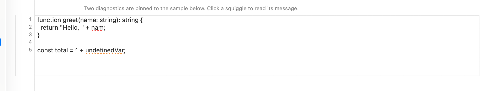
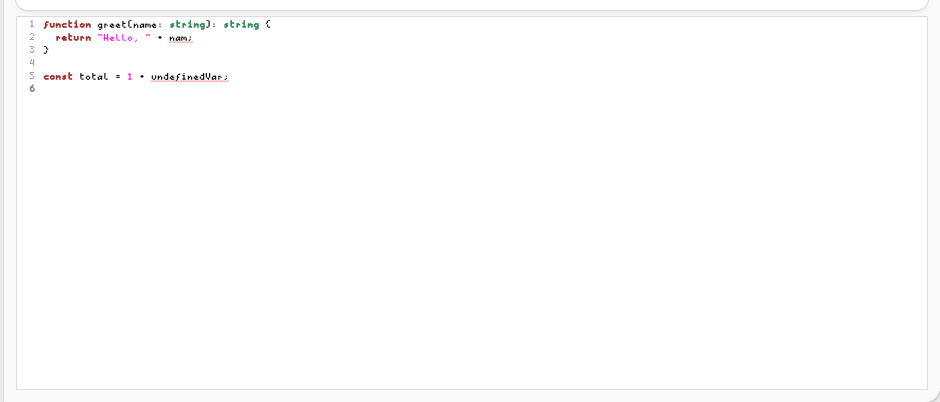

`<codeeditor>` is a syntax-highlighted, line-numbered text editor: GtkSourceView on GTK, a
TextKit 2 `NSTextView` with a ruler gutter on macOS. It renders the `diagnostics` array it is
handed and never analyzes the text itself, the same division `<table>` draws between its rows and
whatever produced them. A language server belongs in app-side TypeScript, not in the widget.





```tsx
const diagnostics = [
  { line: 2, column: 22, severity: "error", message: "Cannot find name 'nam'. Did you mean 'name'?" },
  { line: 5, column: 19, severity: "warning", message: "'undefinedVar' is not defined." },
];

<codeeditor
  text={code}
  language="typescript"
  showLineNumbers
  readOnly={false}
  diagnostics={diagnostics}
  onChange={(e) => setCode(e.text)}
  onCursorMoved={(e) => {
    const { line, column } = e.data as { line: number; column: number };
    console.log(`Line ${line}, Column ${column}`);
  }}
  onDiagnosticClicked={(e) => {
    const d = e.data as { line: number; column: number; severity: string; message: string };
    console.log(d.message);
  }}
/>;
```

## Data shape

```ts
interface CodeDiagnostic {
  line: number; // 1-based
  column: number; // 1-based
  severity: string; // "error" | "warning" | "info" | "hint"
  message: string;
}
```

`CodeDiagnostic` is re-exported from `@nativedesktop/react`, so import it directly:

```ts
import type { CodeDiagnostic } from "@nativedesktop/react";
```

`line`/`column` are 1-based, what every compiler and language server reports. A click on a squiggle
reports the diagnostic pinned to the clicked **line**, not the exact character: a diagnostic's
underline can span from its column to the end of the line, and asking the user to hit one glyph of
a squiggle is not a target anyone can reach.

## Props

| Prop | Type | Default | Applied | Notes |
| --- | --- | --- | --- | --- |
| `text` | string | `""` | createAndUpdate | Controlled. Set it from `onChange` to keep typed edits in state. |
| `language` | string | `""` | createAndUpdate | See [Language and theme](#language-and-theme). |
| `theme` | string | `""` | createAndUpdate | See [Language and theme](#language-and-theme). |
| `showLineNumbers` | bool | `true` | createAndUpdate | GtkSourceView / TextKit 2 gutter. |
| `readOnly` | bool | `false` | createAndUpdate | |
| `tabWidth` | int | `4` | createAndUpdate | Spaces per tab stop. |
| `diagnostics` | `CodeDiagnostic[]` | `[]` | createAndUpdate | Underlines, in the severity's color, with the message on hover. |

## Events

| Event | Handler | Payload | Fires when… |
| --- | --- | --- | --- |
| `changed` | `onChange` | `{ text }` | The text changes, by typing or by a paste. |
| `cursorMoved` | `onCursorMoved` | `{ data: { line, column } }` | The insertion point moves. |
| `diagnosticClicked` | `onDiagnosticClicked` | `{ data: CodeDiagnostic }` | The user clicks a line carrying a diagnostic. |

## Language and theme

`language` is looked up against a keyword table for syntax highlighting: `typescript`,
`javascript`, `python`, `rust`, `go`, `c`, `java`, `ruby`, `shell`, `swift`, `zig`, plus common
aliases (`ts`, `js`, `py`, `rs`, `sh`, …). An unrecognized language still gets comment, string, and
number highlighting, just no keyword coloring.

`theme` means different things on each backend, since the two editors don't share a theming model:

- **macOS** reads `"light"` or `"dark"` and forces that `NSAppearance` on the editor. Leave it
  unset and the editor follows the app's own appearance.
- **GTK** reads a GtkSourceView style-scheme id (`"Adwaita"`, `"Adwaita-dark"`, `"solarized-light"`,
  whatever schemes the system has installed). Leave it unset and the scheme manager's own default
  applies, which already follows the desktop's light/dark setting.

There is no shared `theme` vocabulary between the two backends today. An app that wants the same
`theme` value to mean the same thing on both platforms has to translate it itself.

## GtkSourceView availability

GTK resolves GtkSourceView at runtime with `dlopen`, the same rule `<webview>`'s WebKitGTK and
`audio.play`'s GStreamer follow, so the framework never links against it and a machine without it
still builds and runs. When GtkSourceView is present you get real syntax highlighting, a proper
gutter, and style schemes. When it is absent the widget quietly degrades to a plain `GtkTextView`:

- **Identical either way:** `text`, `readOnly`, `tabWidth`, `changed`, `cursorMoved`, `diagnostics`,
  `diagnosticClicked`. Diagnostics are plain `GtkTextTag` underlines on the buffer, not
  GtkSourceView marks, precisely so this list doesn't shrink when the library is missing.
- **Inert without it:** `language`, `theme`, `showLineNumbers`. No highlighting, no gutter, no style
  scheme, and no error either; the editor still works as a plain text box.

See `examples/parity/main.tsx`'s Code Editor section: a language switcher, line-number and
read-only toggles, two diagnostics pinned to a sample with a real bug in it, and live readouts for
the cursor position and the last diagnostic clicked.
