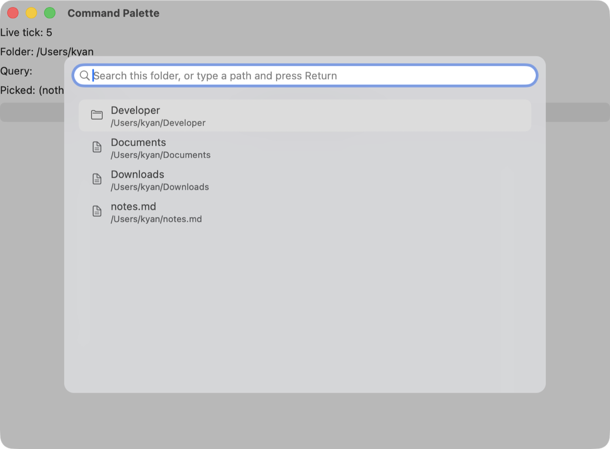

`<commandpalette>` is a modal overlay for search-driven command/file/navigation pickers, the
Cmd-K pattern. It follows the same controlled contract as `<table>` and `<treeview>`: the widget
never filters, ranks, or reorders anything itself. Every keystroke fires `queryChanged`, the app
recomputes the result set (locally or over an RPC), and hands the new `items` array back down.




```tsx
import { render, useMemo, useState } from "@nativedesktop/react";

interface Command {
  id: string;
  title: string;
  subtitle: string;
  iconName: string;
}

const COMMANDS: Command[] = [
  { id: "new-file", title: "New File", subtitle: "File > New", iconName: "document-new" },
  { id: "new-window", title: "New Window", subtitle: "File > New Window", iconName: "window-new" },
  { id: "close-tab", title: "Close Tab", subtitle: "File > Close", iconName: "window-close" },
  { id: "toggle-sidebar", title: "Toggle Sidebar", subtitle: "View > Sidebar", iconName: "sidebar-show" },
];

function App(): React.ReactNode {
  const [open, setOpen] = useState(false);
  const [query, setQuery] = useState("");

  // App-side ranking: the widget only ever renders what this returns, in order.
  const items = useMemo(() => {
    const q = query.toLowerCase();
    return COMMANDS.filter((c) => c.title.toLowerCase().includes(q))
      .sort((a, b) => a.title.localeCompare(b.title));
  }, [query]);

  const runCommand = (id: string): void => {
    console.log("run", id);
    setOpen(false);
  };

  return (
    <window title="Command Palette" defaultWidth={640} defaultHeight={420}>
      <box orientation="vertical" spacing={8}>
        <button label="Open (Cmd-K)" onClick={() => { setQuery(""); setOpen(true); }} />
        <commandpalette
          open={open}
          placeholder="Type a command…"
          query={query}
          items={items}
          onQueryChanged={(e) => setQuery(e.text)}
          onActivate={(e) => runCommand(e.text)} // e.text is the activated row's id
          onSubmit={() => setOpen(false)}
          onCancel={() => setOpen(false)}
        />
      </box>
    </window>
  );
}

await render(<App />);
```

## Props

| Prop | Type | Default | Applied | Notes |
| --- | --- | --- | --- | --- |
| `open` | bool | `false` | createAndUpdate | Presentation state. Setting it `true` presents the overlay; `false` dismisses it programmatically (see [Cancel vs. programmatic close](#cancel-vs-programmatic-close)). |
| `placeholder` | string | none | createAndUpdate | Search field placeholder text. |
| `query` | string | `""` | createAndUpdate | The search field's text. Controlled: the field never edits itself out from under you. |
| `items` | `CommandPaletteItem[]` | none | createAndUpdate | The result rows, already filtered, ranked, and ordered by the app. The widget renders them in order and never reorders or filters them. |
| `testID` | string | none | meta | Automation identifier. |

`CommandPaletteItem` (`schema/widgets.json`'s shared shape): `{ id: string, title: string,
subtitle?: string, iconName?: string }`. `id` is a stable string the app assigns; it never needs
to be a visible label. It is the value echoed back by `activate`.

## Events

| Event | Handler | Payload | Notes |
| --- | --- | --- | --- |
| `queryChanged` | `onQueryChanged` | `{ text }` | Fires on every keystroke in the search field. |
| `activate` | `onActivate` | `{ text }` | `text` is the activated row's `id`, not its title. Fires on Enter with a highlighted row, or a click/tap on a row. |
| `submit` | `onSubmit` | `{ text }` | `text` is the raw, currently-typed query. Fires on Enter with no row highlighted, or Cmd/Ctrl+Enter regardless of highlight. |
| `cancel` | `onCancel` | none | User-initiated dismissal only: Escape, or a click outside the card. See below. |

## The controlled-query + app-side-ranking pattern

`<commandpalette>` does no matching of its own. That work (substring match, fuzzy score, recency,
an RPC round-trip to a server-side index) is entirely the app's, in `onQueryChanged`. This mirrors
`<table>`'s sort contract: the native widget is a dumb renderer for whatever ordered array you hand
it, so ranking logic lives in one place you can unit-test outside the UI, and swapping local
filtering for a real search backend never touches the widget.

Highlight (which row Up/Down/Enter act on) is the one piece of state the widget keeps internally,
not the app: it clamps within the current `items` on Up/Down/Home/End and resets to the top row
whenever a fresh `items` array lands. An app that re-renders on a timer or a poll (a live client
re-fetching results) can safely hand back a new `items` array on every render: both backends
diff the row content and skip the rebuild when nothing actually changed, so keyboard focus and the
current highlight survive unrelated re-renders.

## Cancel vs. programmatic close

Setting `open={false}` from your own code (for example after `onActivate` picks a row) closes the
overlay silently. It does not fire `cancel`. `cancel` fires only when the *user* dismisses the
palette without picking anything: Escape, or a click on the dimmed backdrop outside the card. Treat
`cancel` as "the user backed out," and treat your own `setOpen(false)` calls (after `activate` or
`submit`) as the app's own decision to close, with no separate event needed.

## Platform presentation

| | Linux (GTK) | macOS (AppKit) |
| --- | --- | --- |
| Surface | `AdwDialog` in floating presentation mode: centered, scrimmed, non-bottom-sheet | A dimmed full-window scrim view with a centered `NSVisualEffectView` card |
| Search field | `GtkSearchEntry` | `NSSearchField` |
| Results | `GtkListBox` of `AdwActionRow`s (`boxed-list` style) | `NSTableView`, 40pt rows |
| Submit shortcut | Ctrl+Return | Cmd+Return or Ctrl+Return |

Both backends present the overlay over the application's currently-active window, not merely
whatever window the `<commandpalette>` node happens to be mounted under, so one palette, mounted
once near the root, works correctly regardless of which window has focus.

## Automation notes

The palette's tracked node is a host-only handle; the real search field and row list live in a
separately presented dialog/scrim, so automation routes actions to them explicitly rather than
through the generic click/type dispatch:

- `click` (no `ref` beyond the palette's own) activates the currently highlighted row.
- `type` inserts text into the search field (fires `queryChanged`), appending at the cursor.
- `setValue` is overloaded by argument type: a string replaces the query text, an integer activates
  the row at that index, and `true` submits the current query as-is.
- The palette is only actionable while presented (`open` is effectively `true`); `getTree` and the
  action dispatchers report it as not-actionable while closed.

`scripts/command-palette-drive.ts` exercises all of this against `examples/command-palette`
under background re-render churn: open via a real button click, `type` to filter, `click` to
activate the highlighted directory, `setValue` with a string/integer/boolean to replace the query,
drill in by index, and submit a typed path that matches no row. See
[Automation Socket](/automation-testing/automation-socket/) for the full RPC surface.

See `examples/command-palette/main.tsx` for the complete example (a directory picker with live
background re-renders), and the [Widget Reference](/components/widget-reference/) for every
widget's generated prop table.
