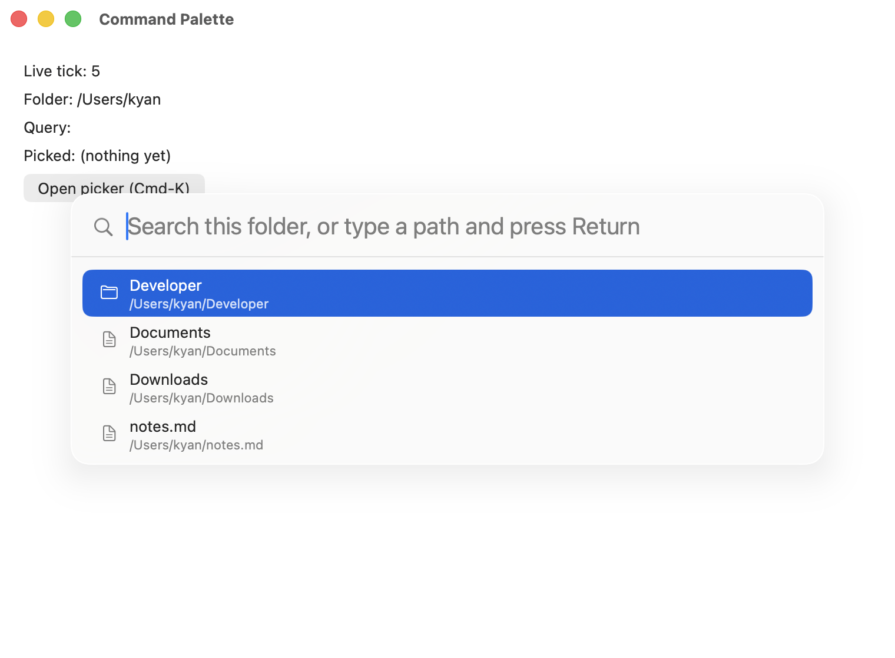
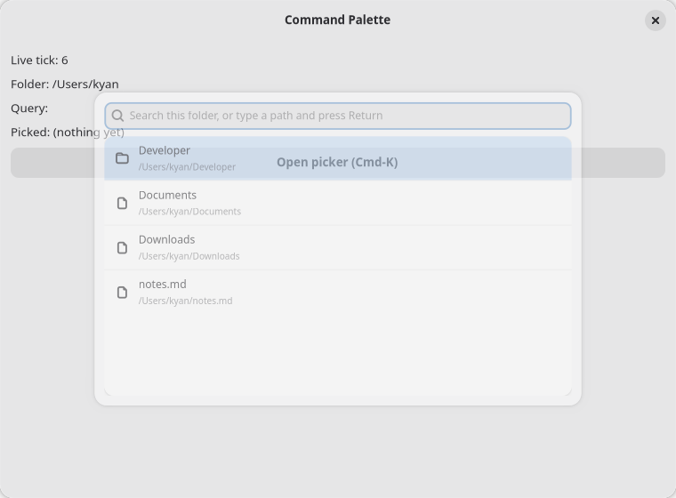

`<commandpalette>` is a modal overlay for search-driven command, file, and navigation pickers: the
Cmd-K pattern. The widget never filters, ranks, or reorders anything. Every keystroke fires
`queryChanged`, the app recomputes the result set (locally or over an RPC), and hands the new
`items` array back down.





```tsx
import { render } from "@nativedesktop/solid";
import { createMemo, createSignal } from "solid-js";

interface Command {
  id: string;
  title: string;
  subtitle: string;
  iconName: string;
}

const COMMANDS: Command[] = [
  { id: "new-file", title: "New File", subtitle: "File > New", iconName: "document-new" },
  { id: "new-window", title: "New Window", subtitle: "File > New Window", iconName: "window-new" },
  { id: "close-tab", title: "Close Tab", subtitle: "File > Close", iconName: "window-close" },
  { id: "toggle-sidebar", title: "Toggle Sidebar", subtitle: "View > Sidebar", iconName: "sidebar-show" },
];

function App() {
  const [open, setOpen] = createSignal(false);
  const [query, setQuery] = createSignal("");

  // App-side ranking: the widget only ever renders what this returns, in order.
  const items = createMemo(() => {
    const q = query().toLowerCase();
    return COMMANDS.filter((c) => c.title.toLowerCase().includes(q))
      .sort((a, b) => a.title.localeCompare(b.title));
  });

  const runCommand = (id: string): void => {
    console.log("run", id);
    setOpen(false);
  };

  return (
    <window title="Command Palette" defaultWidth={640} defaultHeight={420}>
      <box orientation="vertical" spacing={8}>
        <button label="Open (Cmd-K)" onClick={() => { setQuery(""); setOpen(true); }} />
        <commandpalette
          open={open()}
          placeholder="Type a command…"
          query={query()}
          items={items()}
          onQueryChanged={(e) => setQuery(e.text)}
          onActivate={(e) => runCommand(e.text)} // e.text is the activated row's id
          onSubmit={() => setOpen(false)}
          onCancel={() => setOpen(false)}
        />
      </box>
    </window>
  );
}

await render(() => <App />);
```

## Props

| Prop | Type | Default | Applied | Notes |
| --- | --- | --- | --- | --- |
| `open` | bool | `false` | createAndUpdate | Presentation state. Setting it `true` presents the overlay; `false` dismisses it programmatically (see [Cancel vs. programmatic close](#cancel-vs-programmatic-close)). |
| `placeholder` | string | none | createAndUpdate | Search field placeholder text. |
| `query` | string | `""` | createAndUpdate | The search field's text. Controlled: the field never edits itself out from under you, and every present starts from the last `query` you set, not from what was typed into an earlier present. |
| `items` | `CommandPaletteItem[]` | none | createAndUpdate | The result rows, already filtered, ranked, and ordered by the app. The widget renders them in order and never reorders or filters them. |
| `testID` | string | none | meta | Automation identifier. |

`CommandPaletteItem` (`schema/widgets.json`'s shared shape): `{ id: string, title: string,
subtitle?: string, iconName?: string, iconData?: string, hint?: string, completion?: string }`.
`id` is a stable string the app assigns; it never needs to be a visible label. It is the value
echoed back by `activate`.

A row is one line: the icon, the title, the subtitle in secondary text after it, and `hint`
right-aligned (what Enter does on that row, "Switch to Tab", or a shortcut). `iconData` is a
`data:` URL or bare base64 image, a favicon for example, and wins over `iconName`. When a row is
too narrow the subtitle truncates first, then the title; the hint never does.

## Inline completion

`completion` on the first row completes what the user is typing, the way a browser's address bar
does. When it starts with the typed text (case-insensitively) and the last edit inserted text, the
field shows the rest of it selected after the caret. Typing replaces the selection and completes
again; Backspace removes it and does not bring it back until the next insertion; Tab or Right
accepts it, and only then does `queryChanged` carry the whole text. `submit` always carries the
typed text, never an unaccepted completion, and Enter on a completion row whose completion was
removed submits instead of activating it.

## Events

| Event | Handler | Payload | Notes |
| --- | --- | --- | --- |
| `queryChanged` | `onQueryChanged` | `{ text }` | Fires on every keystroke in the search field. |
| `activate` | `onActivate` | `{ text }` | `text` is the activated row's `id`, not its title. Fires on Enter with a highlighted row, or a click/tap on a row. |
| `submit` | `onSubmit` | `{ text }` | `text` is the raw, currently-typed query. Fires on Enter with no row highlighted, or Cmd/Ctrl+Enter regardless of highlight. |
| `cancel` | `onCancel` | none | User-initiated dismissal only: Escape, or a click outside the card. See below. |

## Ranking

The palette does no matching. Substring match, fuzzy score, recency, an RPC round-trip to a
server-side index: all of it happens in your `onQueryChanged`, and the widget renders whatever
ordered array you hand back.

Highlight (the row Up/Down/Enter act on) is the one piece of state the widget keeps internally. It
clamps within the current `items` on Up/Down/Home/End and resets to the top row whenever a fresh
`items` array lands. Both backends diff row content and skip the rebuild when nothing changed, so
an app updating on a timer or a poll can hand back a new `items` array on every update without
losing keyboard focus or the current highlight.

## Cancel vs. programmatic close

Setting `open={false}` yourself, for example after `onActivate` picks a row, closes the overlay
without firing `cancel`. `cancel` fires only on user dismissal: Escape, or a click on the dimmed
backdrop outside the card.

## Platform presentation

| | Linux (GTK) | macOS (AppKit) |
| --- | --- | --- |
| Surface | A window-sized `AdwDialog` with a transparent sheet; its scrim dims the window and the 640 px card inside it is centered horizontally with its top edge at 18 percent of the window height | A scrim (black at 15 percent) over the whole window, toolbar and sidebar included, under a 640 pt Liquid Glass card, centered horizontally with its top edge at 18 percent of the window height |
| Search field | `GtkSearchEntry` | A borderless 20 pt `NSTextField` |
| Results | `GtkListBox` of one-line rows, 40px | `NSTableView` (inset style), one-line 40 pt rows |
| Submit shortcut | Ctrl+Return | Cmd+Return or Ctrl+Return |

On both, the field stays put while rows change and the card follows its row count. Neither
backend animates the open or close: a palette is opened from the keyboard many times a day.

Both backends present the overlay over the application's currently-active window rather than the
window the `<commandpalette>` node is mounted under, so one palette mounted near the root works
whichever window has focus.

## Automation

The palette's tracked node is a host-only handle. The real search field and row list live in a
separately presented dialog or scrim, so automation routes actions to them explicitly instead of
going through the generic click/type dispatch:

- `click` (no `ref` beyond the palette's own) activates the currently highlighted row.
- `type` inserts text into the search field (fires `queryChanged`), appending at the cursor.
- `setValue` is overloaded by argument type: a string replaces the query text, an integer activates
  the row at that index, and `true` submits the current query as-is.
- `paletteLayout` (RPC, `app.paletteLayout(target)`) answers the presented panel's geometry: the
  panel, the field with its text and selection, and each drawn row's icon, title, subtitle and hint
  rects plus whether its text is truncated. A drive asserts centring and row fit with it instead
  of reading pixels.
- The palette is only actionable while presented (`open` is effectively `true`); `getTree` and the
  action dispatchers report it as not-actionable while closed.

`scripts/command-palette-drive.ts` exercises all of this against `examples/command-palette` under
background update churn. See [Automation Socket](/automation-testing/automation-socket/) for the
full RPC surface, `examples/command-palette/main.tsx` for the complete example, and the
[Widget Reference](/components/widget-reference/) for the generated prop table.
