`@nativedesktop/ui` (`packages/ui/`) is a composition layer over widgets that already exist: every
component here renders ordinary intrinsics (`<box>`, `<row>`, `<button>`, `<expander>`...) and holds
no state of its own beyond what a controlled prop gives it. Nothing in this package touches
`schema/widgets.json` or the ABI, the same precedent `@nativedesktop/panes` set for `PaneTree` (see
[Split Views](/native-platform/split-views/)). Install it as a workspace dependency and import from
`@nativedesktop/ui`; it peer-depends on `@nativedesktop/react`.

## Accordion

A stack of [`Expander`s](/components/menus-and-popovers/), one per item, with
`expandedIds` as controlled state. `allowMultiple` (default `false`) decides whether opening one
item closes the others.

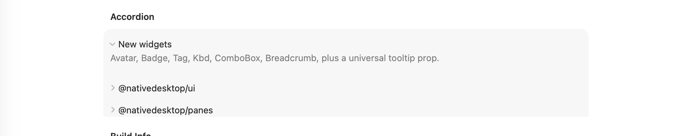

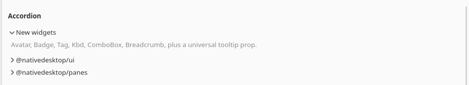

```tsx
const [expandedIds, setExpandedIds] = useState<string[]>(["intro"]);

<Accordion
  items={[{ id: "intro", label: "Introduction", content: <label text="..." /> }]}
  expandedIds={expandedIds}
  onExpandedChange={setExpandedIds}
/>;
```

| Prop | Type | Notes |
| --- | --- | --- |
| `items` | `{ id, label, content: ReactNode }[]` | |
| `expandedIds` | `string[]` | Controlled: ids of the currently open items. |
| `onExpandedChange` | `(ids: string[]) => void` | |
| `allowMultiple` | boolean | Default `false`: opening one item closes the others. |

`nextExpandedIds` (also exported) is the pure function behind `onExpandedChange`'s computation, if
you need the same open/close logic somewhere that isn't an `Accordion`.

## DescriptionList

A `<settingsgroup>` of `<row>`s in `.property` style, for read-only key/value pairs: build info,
account details, a summary screen. No interaction, no events.

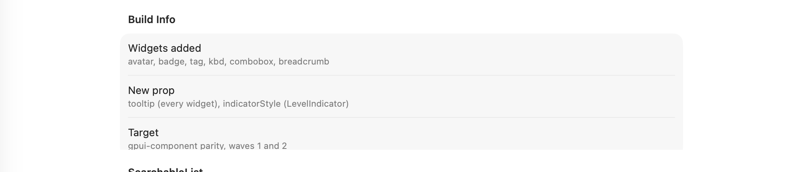

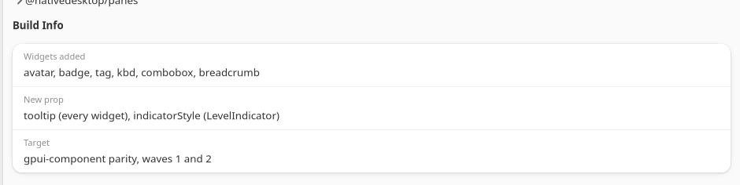

```tsx
<DescriptionList title="Build Info" items={[{ label: "Version", value: "0.1.2" }]} />;
```

| Prop | Type | Notes |
| --- | --- | --- |
| `items` | `{ label, value }[]` | |
| `title` | string | Optional group heading. |

## Pagination

A linked row of page buttons (First/Prev, numbered pages with an ellipsis gap, Next/Last), windowed
around the current page.

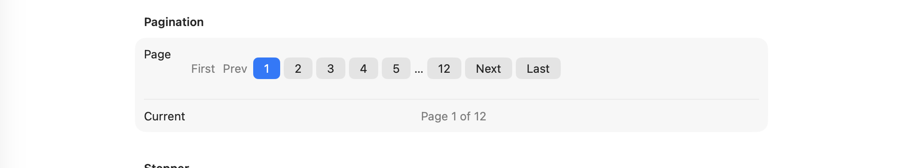

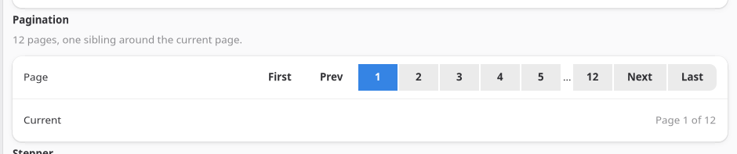

```tsx
const [page, setPage] = useState(1);

<Pagination page={page} pageCount={12} onPageChange={setPage} />;
```

| Prop | Type | Notes |
| --- | --- | --- |
| `page` | number | Controlled, 1-based. |
| `pageCount` | number | `Pagination` renders nothing when `pageCount <= 0`. |
| `onPageChange` | `(page: number) => void` | |
| `siblingCount` | number | Pages shown on each side of the current page before collapsing to `…`. Default `1`. |

`computePaginationRange` (also exported) is the pure windowing function, useful for testing a custom
pager or rendering the range some other way.

## Stepper

A horizontal row of numbered circles and separators for a multi-step flow, each step's state
(`completed` / `active` / `pending`) derived from `activeIndex`.

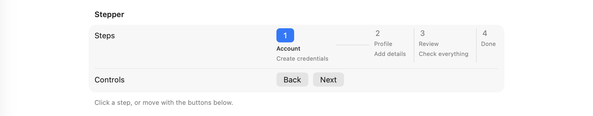

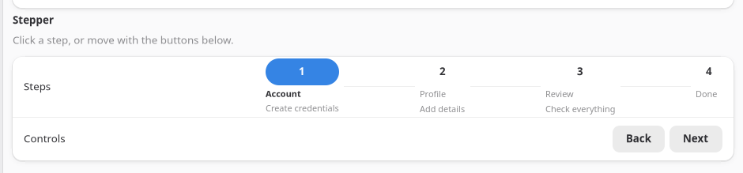

```tsx
const [step, setStep] = useState(0);

<Stepper steps={[{ id: "account", title: "Account" }]} activeIndex={step} onStepClick={setStep} />;
```

| Prop | Type | Notes |
| --- | --- | --- |
| `steps` | `{ id, title, description? }[]` | |
| `activeIndex` | number | |
| `onStepClick` | `(index: number) => void` | Optional. Omit to make the steps display-only. |

`stepState` (also exported) is the pure `index, activeIndex -> "completed" | "active" | "pending"`
function.

## HoverCard

A `<popover>` that opens after a hover delay and closes after a leave delay, anchored to its
children.


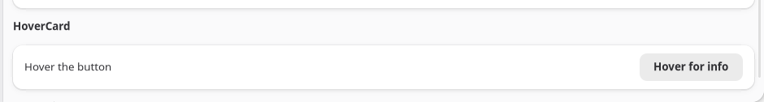

```tsx
<HoverCard content={<label text="Extra detail." />}>
  <button label="Hover for info" />
</HoverCard>;
```

| Prop | Type | Notes |
| --- | --- | --- |
| `content` | ReactNode | The popover's body. |
| `children` | ReactNode | The anchor. |
| `openDelay` / `closeDelay` | number (ms) | Default `400` / `200`. |

There is no separate hover-enter/hover-leave event on the underlying widget, only one
`hoverChanged` boolean, so both the open and close timers key off it. A fast pass-through pointer
never flashes the card open, since the open timer is cleared before it fires.

## SearchableList

A `<searchinput>` over a `<listview>`, filtered client-side as the user types.

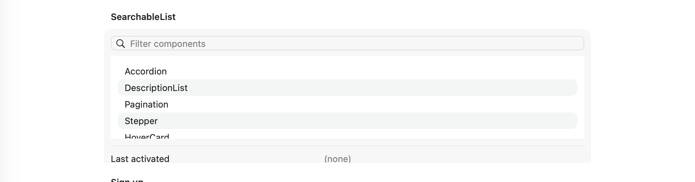

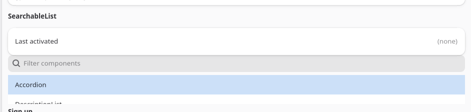

```tsx
<SearchableList
  items={[{ id: "a", label: "Apple" }]}
  onActivate={(item) => console.log(item.label)}
  placeholder="Filter"
/>;
```

| Prop | Type | Notes |
| --- | --- | --- |
| `items` | `{ id, label }[]` | |
| `onActivate` | `(item) => void` | Fires on row activation (double-click / Enter), matching `ListView`'s own event. |
| `filter` | `(item, query) => boolean` | Overrides the default case-insensitive label match. |
| `placeholder`, `emptyIconName`, `emptyTitle`, `emptyDescription` | string | Passed straight through to `searchinput`/`listview`. |

`defaultFilter` and `filterItems` (also exported) are the pure matching functions.

## Form and FormField

`Form` is a titled `<settingsgroup>`; `FormField` is a `<row>` that shows `error` (styled with the
`error` cssClass) in place of `hint` when a field fails validation, and puts its `children` in the
row's control slot.

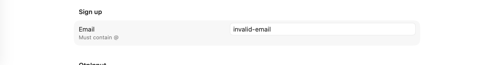

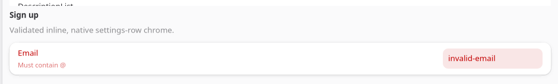

```tsx
const [email, setEmail] = useState("");
const error = email.length > 0 && !email.includes("@") ? "Must contain @" : undefined;

<Form title="Sign up">
  <FormField label="Email" error={error} hint="We'll only use this for updates">
    <textinput text={email} onChanged={(e) => setEmail(e.text)} />
  </FormField>
</Form>;
```

| Component | Prop | Type | Notes |
| --- | --- | --- | --- |
| `Form` | `title`, `description` | string | |
| `FormField` | `label` | string | |
| `FormField` | `error` | string | Shown instead of `hint` when present; adds the `error` cssClass to the row. |
| `FormField` | `hint` | string | Shown when there is no `error`. |

Validation itself is app logic; `Form`/`FormField` only render the state you compute.

## OtpInput

`length` single-character `<textinput>` cells (`.numeric` cssClass) for a verification code, with
auto-advance on entry and paste-fill across cells handled for you.


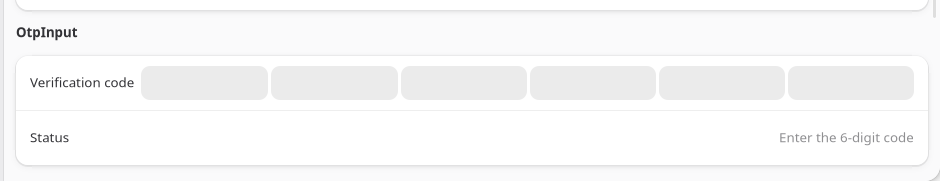

```tsx
const [code, setCode] = useState("");

<OtpInput length={6} value={code} onChange={setCode} onComplete={(v) => console.log("done", v)} />;
```

| Prop | Type | Notes |
| --- | --- | --- |
| `length` | number | Default `6`. |
| `value` | string | Controlled. |
| `onChange` | `(value: string) => void` | |
| `onComplete` | `(value: string) => void` | Fires once `value.length === length`. |

`otpCellChanged` and `otpChars` (also exported) are the pure per-cell edit and padding functions.
Caveat: there is no `focus` command on `<textinput>` in the current widget ABI, so a completed cell
cannot move the caret to the next box programmatically. Every cell stays editable so a user typing
out of order is never blocked, but auto-advance is visual only, not a real focus move.

## ButtonGroup

A linked row of buttons, either a plain action group or, with `selectedId`, a single-select toggle
group (the matching button renders `prominent`).


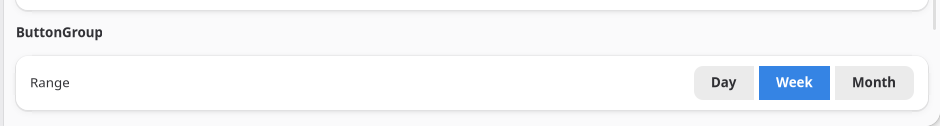

```tsx
const [range, setRange] = useState("week");

<ButtonGroup items={[{ id: "day", label: "Day" }, { id: "week", label: "Week" }]} selectedId={range} onPress={setRange} />;
```

| Prop | Type | Notes |
| --- | --- | --- |
| `items` | `{ id, label, iconName? }[]` | |
| `onPress` | `(id: string) => void` | |
| `selectedId` | string | Omit for a plain action group with no selection state. |

## StatusBar

A three-slot horizontal bar (`.toolbar` cssClass) for a window or panel's bottom edge: `left`,
`center`, and `right` each take arbitrary content.

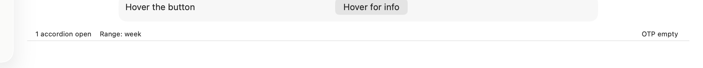

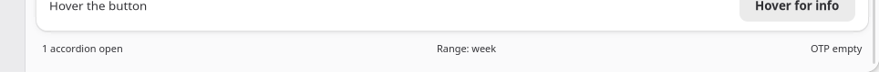

```tsx
<StatusBar left={<label text="Ready" />} right={<label text="v0.1.2" />} />;
```

| Prop | Type | Notes |
| --- | --- | --- |
| `left`, `center`, `right` | ReactNode | Each renders in its own `halign`ed sub-box; any are optional. |

See `examples/parity/main.tsx`'s Composition section for all ten components wired to live state.
