Six widgets added to close the gap with [gpui-component](https://longbridge.github.io/gpui-component/):
compact identity and status markers (`Avatar`, `Badge`, `Tag`, `Kbd`), a searchable picker
(`ComboBox`), and a path control (`Breadcrumb`). All six are cross-platform, real native widgets on
both AppKit and GTK/Adwaita, declared in `schema/widgets.json` like every other widget.

## Avatar (`<avatar>`)

A round identity marker (`AdwAvatar` on GTK, a SwiftUI view on macOS). Give it `text` and it renders
initials; add `imagePath` for a photo.

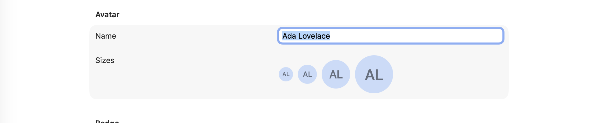

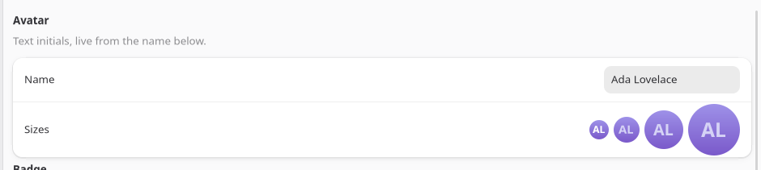

```tsx
<avatar text="Ada Lovelace" size={48} />;
```

| Prop | Type | Applied | Notes |
| --- | --- | --- | --- |
| `text` | string | createAndUpdate | Source for initials, and the automation tree's `text`. |
| `imagePath` | string | createAndUpdate | Overrides initials with a photo when present. |
| `size` | int | create | Diameter in points/px. Default `32`. |
| `showInitials` | bool | create | Falls back to a generic placeholder when `false` and no image. Default `true`. |

No events. `size` and `showInitials` are create-only: change them by remounting the node (a
different `key`), not by writing new props onto an existing one.

## Badge (`<badge>`)

A small status pill (a `GtkLabel` with `.badge` on GTK, a SwiftUI capsule on macOS) for a count
or a state word: "New", "3", "Beta".

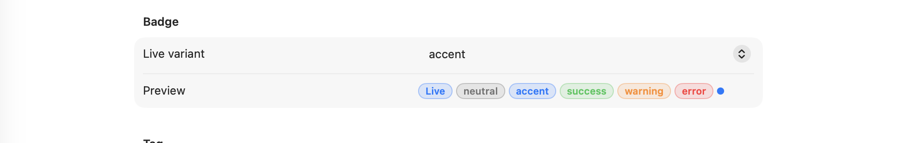

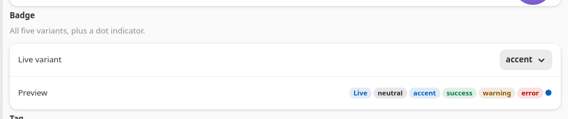

```tsx
<badge label="Beta" variant="accent" />;
<badge dot variant="error" />;
```

| Prop | Type | Applied | Notes |
| --- | --- | --- | --- |
| `label` | string | createAndUpdate | |
| `variant` | `neutral` \| `accent` \| `success` \| `warning` \| `error` | createAndUpdate | Default `neutral`. |
| `dot` | bool | create | Renders as a plain colored dot, no label, for an unread/attention marker. |

No events; `Badge` is read-only. Pair it with a `<row>` or `<button badge>` for a count that lives
next to a label.

## Tag (`<tag>`)

A removable chip (`GtkLabel` with `.pill` on GTK, a SwiftUI capsule on macOS), for filter chips,
selected-skill lists, and similar small removable-item rows.

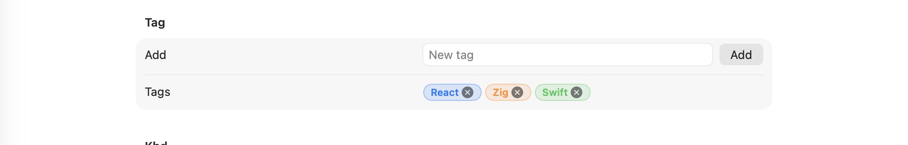

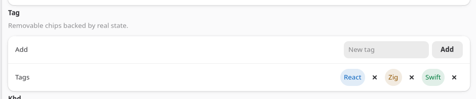

```tsx
const [tags, setTags] = useState(["React", "Zig"]);

<tag label="React" variant="accent" removable onRemoved={() => setTags((t) => t.filter((x) => x !== "React"))} />;
```

| Prop | Type | Applied | Notes |
| --- | --- | --- | --- |
| `label` | string | createAndUpdate | |
| `variant` | `neutral` \| `accent` \| `success` \| `warning` \| `error` | createAndUpdate | Default `neutral`. |
| `removable` | bool | create | Shows the trailing close affordance. |

`removed` → `onRemoved` fires with no payload when the close affordance is clicked. The app owns the
list; `Tag` never removes itself from anything.

## Kbd (`<kbd>`)

A keyboard-shortcut label (`GtkLabel` with `.monospace` and a frame on GTK, a bordered SwiftUI
keycap on macOS), for showing the accelerator next to the command it triggers.

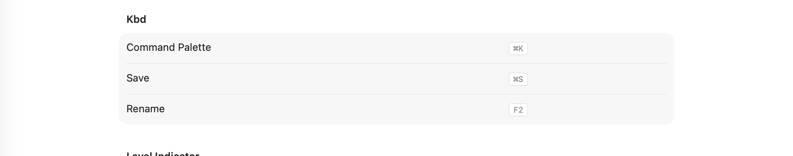

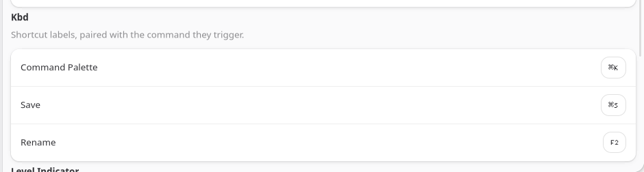

```tsx
<row title="Command Palette">
  <kbd keys="⌘K" />
</row>;
```

| Prop | Type | Applied | Notes |
| --- | --- | --- | --- |
| `keys` | string | createAndUpdate | Rendered as-is; format the key combo string yourself (`"⌘K"`, `"Ctrl+Shift+P"`). |

Display-only, no events. `Kbd` shows a shortcut; it does not register one. Pair it with a real
`accelerator` on a `<menuitem>` (see [Menu Bar](/native-platform/menu-bar/)) if the shortcut should
actually fire.

## ComboBox (`<combobox>`)

`GtkDropDown` with `enable-search` on GTK, `NSComboBox` on macOS: a dropdown that also accepts
typed, free text, unlike [`Select`](/components/widget-reference/), which only picks from the list.

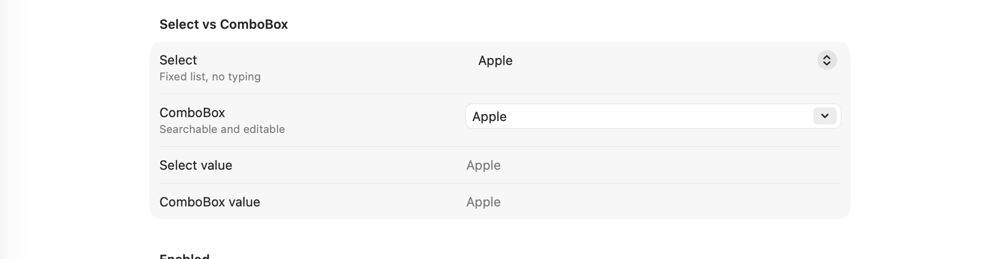

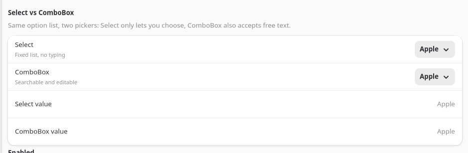

```tsx
const [text, setText] = useState("Apple");

<combobox
  options={["Apple", "Banana", "Cherry"]}
  text={text}
  onSelectionChanged={(e) => setText(["Apple", "Banana", "Cherry"][e.index] ?? text)}
  onChanged={(e) => setText(e.text)}
/>;
```

| Prop | Type | Applied | Notes |
| --- | --- | --- | --- |
| `options` | string[] | create | |
| `selectedIndex` | int | createAndUpdate | `-1` (or no match) when `text` doesn't match an option. |
| `text` | string | createAndUpdate | The field's live content, typed or picked. |
| `placeholder` | string | create | |
| `editable` | bool | create | `false` restricts input to the option list, closer to `Select`. Default `true`. |

`selectionChanged` → `onSelectionChanged` fires `{ index }` when an option is picked from the list.
`changed` → `onChanged` fires `{ text }` on every keystroke, picked or typed. Both events can fire
for the same interaction (picking an option updates both the index and the text); keep `text` as the
source of truth if you only need one.

## Breadcrumb (`<breadcrumb>`)

A path control (a `GtkBox` of flat buttons on GTK, `NSPathControl` on macOS) for a location the user
can click back up: a folder path, a wizard's completed steps.

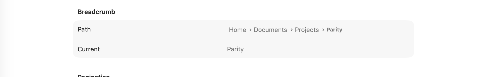

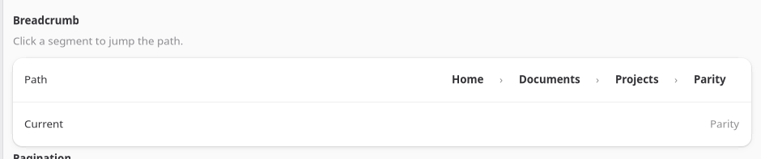

```tsx
const [index, setIndex] = useState(2);

<breadcrumb items={["Home", "Documents", "Projects"]} selectedIndex={index} onItemActivated={(e) => setIndex(e.index)} />;
```

| Prop | Type | Applied | Notes |
| --- | --- | --- | --- |
| `items` | string[] | createAndUpdate | Full path, root first. |
| `selectedIndex` | int | createAndUpdate | Which segment reads as current. Default `-1` (none). |

`itemActivated` → `onItemActivated` fires `{ index }` when a segment is clicked. `Breadcrumb` never
truncates `items` itself; update the array and `selectedIndex` together from the handler.

## LevelIndicator's `indicatorStyle`

[`LevelIndicator`](/components/form-controls/) gained an
`indicatorStyle` prop: `continuous` (the existing fill bar, and the default), `discrete` (fixed
segments), `relevancy` (a search-score style fill), or `rating`, which renders as a row of real
stars (a star row on GTK, `NSLevelIndicator` in `.rating` style on macOS) instead of a bar.

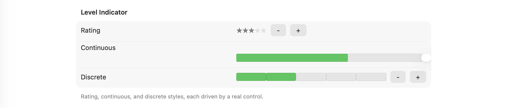

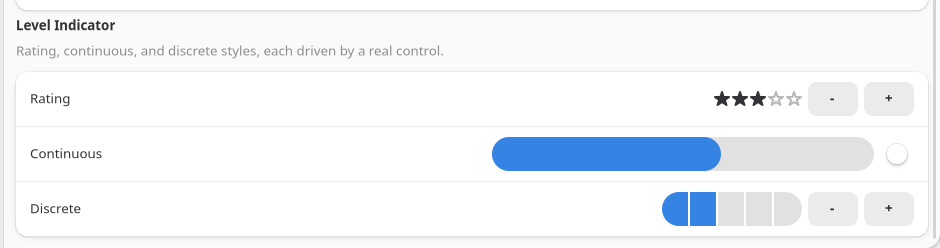

```tsx
<levelindicator indicatorStyle="rating" min={0} max={5} value={3} />;
```

`indicatorStyle` is create-only. `LevelIndicator` has no change event on any style, rating included:
there is no click-to-rate yet. Pair it with real controls (buttons, a slider) that own the value, the
way `examples/parity/main.tsx`'s Display section does for all three styles.

`LevelIndicator` stays plain `NSLevelIndicator` on macOS rather than SwiftUI: it already draws four
distinct system styles (continuous, discrete, relevancy, rating), and SwiftUI has no composable
equivalent for any of them outside a single-value `Gauge`, so there was nothing to gain from
replacing an already-native control.

## The universal `tooltip` prop

Every widget now accepts `tooltip`, a plain string shown on hover (`gtk_widget_set_tooltip_text` on
GTK, `view.toolTip` on macOS). It is `createAndUpdate` everywhere, so it can change with app state
the same as any other live prop:

```tsx
<button iconName="edit-delete" tooltip={itemCount === 0 ? "Nothing to delete" : "Delete"} onClick={deleteSelected} />;
```

There is no separate `<tooltip>` widget; this is a prop, not a component. See the
[Widget Reference](/components/widget-reference/) for confirmation that a given widget's generated
prop table carries it.

See `examples/parity/main.tsx`'s Display, Input, and Navigation sections for all six widgets wired
to live state, and the [Widget Reference](/components/widget-reference/) for the generated prop
tables.
