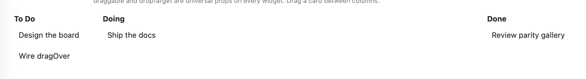
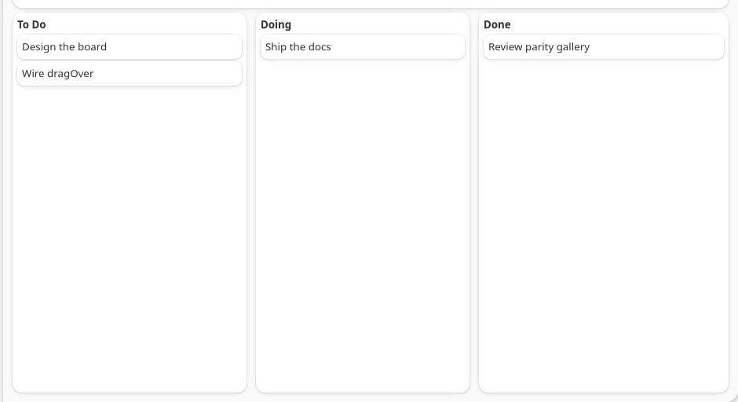

Drag and drop is not a widget. `draggable`, `dragPayload`, and `dropTarget` are three universal
props present on all 70 widgets, alongside their matching `dragStarted`/`dragEnded`/`dragOver`/
`dropped` events. Any box, label, button, or row can be a drag source, a drop target, or both.





Both screenshots show the board at rest rather than mid-drag: GTK cannot synthesize pointer input
for a live drag (`-32003 inputUnsupported`), and the AppKit drag RPC posts an entire gesture in one
marshal, so by the time it returns the drop has already landed.

```tsx
type ColumnId = "todo" | "doing" | "done";

<box
  dropTarget
  cssClasses={hovered ? ["card", "accent"] : ["card"]}
  onDragOver={(e) => setHover({ column: "todo", x: e.data.x, y: e.data.y })}
  onDropped={(e) => moveCard(e.text, "todo")}
>
  <box
    draggable
    dragPayload={card.id}
    onDragEnded={() => setHover(null)}
    cssClasses={["card"]}
  >
    <label text={card.title} />
  </box>
</box>;
```

## Props

| Prop | Type | Default | Applied | Notes |
| --- | --- | --- | --- | --- |
| `draggable` | bool | `false` | createAndUpdate | Makes the widget a drag source. |
| `dragPayload` | string | `""` | createAndUpdate | The app-defined string carried by the drag. Read fresh at drag start, so changing it before the next drag is enough; no need to remount. |
| `dropTarget` | bool | `false` | createAndUpdate | Makes the widget a drop target. |

A widget can be `draggable` and `dropTarget` at once, useful for reordering a list where every row
is both.

## Events

| Event | Fires on | Handler | Payload |
| --- | --- | --- | --- |
| `dragStarted` | the draggable widget | `onDragStarted` | `{ text }`, the widget's own `dragPayload` |
| `dragEnded` | the draggable widget | `onDragEnded` | none, fires whether the drag was dropped or cancelled |
| `dragOver` | the dropTarget widget | `onDragOver` | `{ text, data: { x, y } }` |
| `dropped` | the dropTarget widget | `onDropped` | `{ text, data: { x, y } }` |

`text` on `dragOver`/`dropped` is the source widget's `dragPayload`, echoed to whichever target the
pointer is currently over. `x`/`y` are in the **target** widget's own coordinate space, top-left
origin, the same on both backends: hit-test a drop zone against its own bounds without knowing
which platform drew it.

There is no `dragLeave` event. To un-highlight a target the pointer has left without dropping,
clear the highlight from the source's `dragEnded` instead, since that always fires once the drag
concludes, dropped or not. The kanban board below does exactly this: a column's accent highlight
and its live `x`/`y` readout both come from one piece of state that `dragOver` sets and `dropped`/
`dragEnded` clear.

## Platform notes

- **External drags don't reach these events on macOS.** A drag that starts in another application
  (a file from Finder, text from Safari) never fires `dragStarted`/`dragOver`/`dropped` here. That
  traffic stays on the existing `app.onFileDrop` event from the [System
  Capabilities](/native-platform/system-capabilities/) API. `draggable`/`dropTarget` are for drags
  between your own widgets.
- **A control with its own mouse-tracking loop may not start a drag on macOS.** The drag side is
  an `NSPanGestureRecognizer` attached to the host view. `NSButton` and a few other AppKit controls
  run their own internal mouse-tracking loop on mouse-down that can consume the event before the
  recognizer sees it, so `draggable` on a `<button>` is not guaranteed to start a drag. Wrap the
  button's content in a `<box draggable>` instead, or make a plain `<box>`/`<label>` the drag
  source and put the button elsewhere in the row.
- **GTK payload is a real string on the pasteboard.** The drag rides as a `GdkContentProvider`
  carrying a plain string, so it also interoperates with anything else on the desktop that accepts
  text, not only other NativeDesktop drop targets.
- **`dragOver` fires as soon as the pointer enters a target, before any movement.** Both backends
  preload the payload so a target can hit-test and highlight on the very first frame the pointer is
  over it, rather than only once the user has already moved inside it.

See `examples/parity/main.tsx`'s Drag and Drop section: a three-column kanban board where dragging
a card moves it between columns in real state, `dragOver` highlights the hovered column, and a
label shows the live `x`/`y`.
