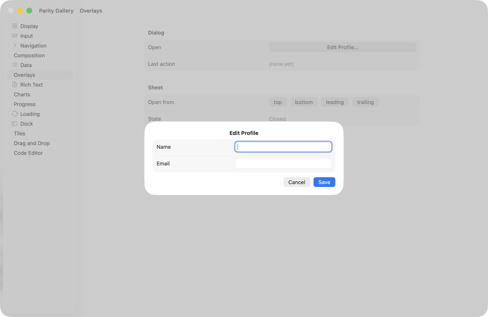
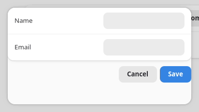
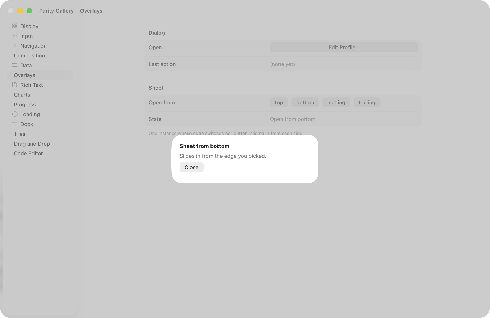
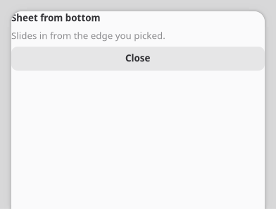

`<dialog>` and `<sheet>` are containers (single child) that mount arbitrary content into a native
modal presentation, rather than prescribing a shape the way `showAlert`/`showAbout` do. Both are
controlled by an `open` prop and report a `closed` event whenever presentation ends, whether your own
code closed them or the user dismissed them natively.

:::note
This is a different mechanism from [Dialogs](/components/dialogs/)'s `showAlert`/`openFile`/
`saveFile`/`showAbout`, which are promise-returning commands for the handful of dialog shapes the OS
already provides. Reach for `<dialog>`/`<sheet>` when the content is your own tree.
:::

The AppKit screenshots below show the whole app window rather than just the card, since macOS
presents both as a separate sheet window layered over the app and there is no isolated "just the
sheet" capture to take; GTK's screenshots crop to the card because `AdwDialog` presents in-window.

## Dialog (`<dialog>`)

A modal window for arbitrary content: `AdwDialog` on GTK, an `NSWindow` sheet on macOS.





```tsx
const [open, setOpen] = useState(false);
const [name, setName] = useState("");

<dialog open={open} title="Edit Profile" contentWidth={360} contentHeight={220} onClosed={() => setOpen(false)}>
  <box orientation="vertical" spacing={Spacing.md} style={{ padding: Spacing.lg }}>
    <textinput text={name} onChanged={(e) => setName(e.text)} />
    <button label="Save" onClick={() => setOpen(false)} />
  </box>
</dialog>;
```

| Prop | Type | Applied | Notes |
| --- | --- | --- | --- |
| `open` | bool | createAndUpdate | Controlled visibility. Default `false`. |
| `title` | string | createAndUpdate | GTK shows it in the `AdwDialog` header. macOS draws no titlebar for a sheet, so it is set as a bold headline above your content instead, the way `NSAlert` lays its own message out. |
| `contentWidth` / `contentHeight` | int | createAndUpdate | Default `0`, which lets the content size itself. |
| `closable` | bool | createAndUpdate | Default `true`. Set `false` to drop the built-in close affordance and require your own button. |

| Event | Handler | Payload |
| --- | --- | --- |
| `closed` | `onClosed` | none |

`closed` fires whenever the dialog stops being presented, not only when you set `open={false}`
yourself. Escape and clicking outside close it natively too. Sync your `open` state from the handler
so the two can't disagree.

## Sheet (`<sheet>`)

A panel anchored to one edge of the window instead of centered, for a detail pane or inspector that
slides in and out. Same container shape as Dialog: single child, your own layout inside.





```tsx
const [open, setOpen] = useState(false);

<sheet open={open} edge="trailing" size={320} onClosed={() => setOpen(false)}>
  <box orientation="vertical" spacing={Spacing.sm} style={{ padding: Spacing.lg }}>
    <label text="Details" cssClasses={["heading"]} />
  </box>
</sheet>;
```

| Prop | Type | Applied | Notes |
| --- | --- | --- | --- |
| `open` | bool | createAndUpdate | Controlled visibility. Default `false`. |
| `edge` | `top` \| `bottom` \| `leading` \| `trailing` | createAndUpdate | Which side it slides in from. Default `bottom`. `leading`/`trailing` follow layout direction rather than literal left/right. Inert on AppKit: macOS presents every sheet from the window's title bar regardless of this value. GTK honours it with `AdwDialog`'s bottom-sheet presentation. |
| `size` | int | createAndUpdate | Thickness on the axis perpendicular to `edge`: height for `top`/`bottom`, width for `leading`/`trailing`. Default `320`. Inert on AppKit for the same reason `edge` is: with no edge to anchor to there is no axis for it to measure, so the sheet sizes to its content. |

| Event | Handler | Payload |
| --- | --- | --- |
| `closed` | `onClosed` | none |

`edge` is still reported back to your app (state, tests) on both platforms; it just doesn't steer
AppKit geometry. One `<sheet>` node can serve every edge: change `edge` on the same node rather than
mounting four separate sheets, as `examples/parity/main.tsx`'s Overlays section does.

See the [Widget Reference](/components/widget-reference/) for the generated prop tables and
`examples/parity/main.tsx`'s Overlays section for both wired to state.
