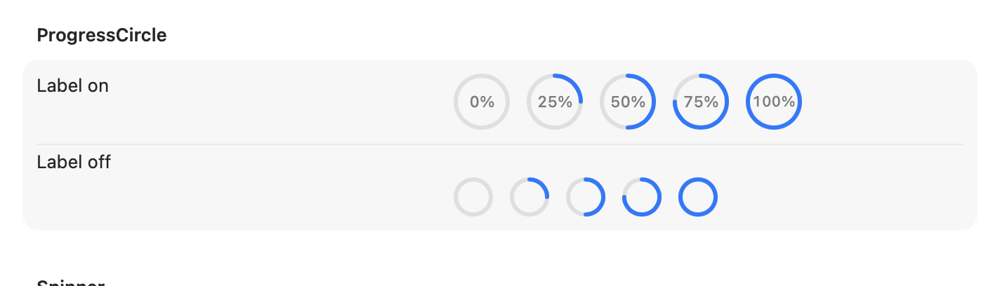
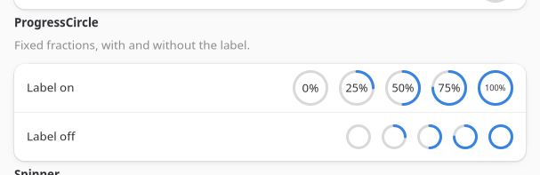
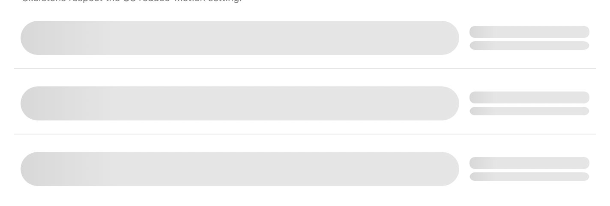
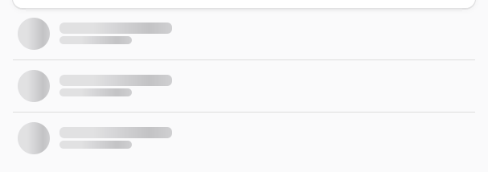

Two widgets fill out the progress and loading vocabulary: `ProgressCircle` for a determinate ring
where a bar doesn't fit, and `Skeleton` for a shimmering placeholder while content loads. ProgressBar
and Spinner (linear-determinate and indeterminate) are already covered in the
[Widget Reference](/components/widget-reference/).

On macOS, ProgressBar and Spinner are SwiftUI `ProgressView`s, hosted the same way the rest of the
leaf widgets are. Both toolkits custom-draw ProgressCircle, because neither ships a determinate ring:
GTK draws the arc with Cairo, macOS with a trimmed SwiftUI `Circle`.

## ProgressCircle (`<progresscircle>`)

A determinate ring, custom-drawn on both backends since neither toolkit ships one: Cairo on GTK, a
trimmed SwiftUI `Circle` on macOS. With `showLabel` the ring is drawn larger, and the percentage is
scaled to sit inside it.





```tsx
<progresscircle fraction={0.62} showLabel />;
```

| Prop | Type | Applied | Notes |
| --- | --- | --- | --- |
| `fraction` | float | createAndUpdate | `0`–`1`. Default `0`. |
| `lineWidth` | int | createAndUpdate | Ring thickness in points/px, honoured on both backends. Clamped to a third of the ring's diameter so the stroke can never close the hole. Default `3`. |
| `showLabel` | bool | createAndUpdate | Renders the percentage as centered text. Default `false`. |

Display-only, no events.

On macOS, `<spinner spinning={false}>` hides the indicator instead of leaving a static (non-spinning)
glyph on screen: SwiftUI's `ProgressView` has no public API to freeze an indeterminate spinner's
animation the way AppKit's `NSProgressIndicator.stopAnimation` did. GTK still shows a static glyph.

## Skeleton (`<skeleton>`)

A shimmering placeholder block for the shape of content that hasn't loaded yet, sized and rounded to
match what it stands in for.





```tsx
<skeleton width={140} height={14} />;
// A circular placeholder, e.g. for an avatar:
<skeleton width={40} height={40} radius={20} />;
```

| Prop | Type | Applied | Notes |
| --- | --- | --- | --- |
| `width` | int | createAndUpdate | `0` sizes to the parent instead of a fixed width. Default `0`. |
| `height` | int | createAndUpdate | Default `16`. |
| `radius` | int | createAndUpdate | Corner radius. Default `6`; set to half of `width`/`height` for a circle. |
| `animated` | bool | createAndUpdate | Default `true`. The shimmer stays static under the OS reduce-motion setting regardless of this prop. |

Display-only, no events. Compose several into the shape of the row or card you're loading, and swap
them for the real content once it arrives. See `examples/parity/main.tsx`'s Loading section.
