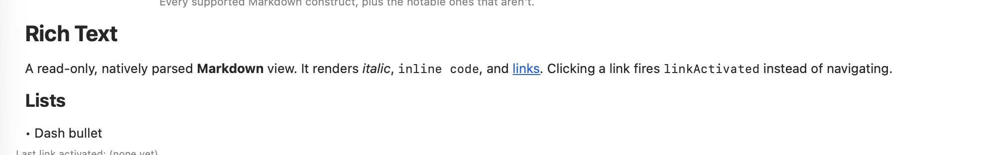
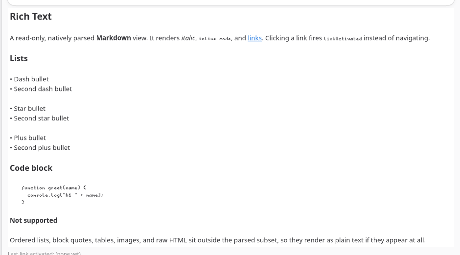

`<richtext>` parses a constrained Markdown subset and renders it with each platform's own text
system, not a web view: an `NSTextView` fed a parsed `NSAttributedString` on macOS, a native text
widget on GTK.





```tsx
const markdown = `# Release Notes

**v0.2** adds *dark mode* and a \`--strict\` flag. See
[the changelog](https://example.com/changelog) for details.

- Faster startup
- Fixed a crash on quit

\`\`\`
nd build --strict
\`\`\`
`;

<richtext markdown={markdown} onLinkActivated={(e) => openExternal(e.text)} />;
```

| Prop | Type | Applied | Notes |
| --- | --- | --- | --- |
| `markdown` | string | createAndUpdate | The source text, re-parsed on every change. |
| `selectable` | bool | createAndUpdate | Whether the rendered text can be selected and copied. Default `true`. |

| Event | Handler | Payload |
| --- | --- | --- |
| `linkActivated` | `onLinkActivated` | `text`, the link's `href` |

Clicking a link never navigates the view; it fires `linkActivated` and leaves handling up to you.
Pair it with [`openExternal`](/native-platform/system-capabilities/#shell-helpers) from
`@nativedesktop/react` to open it in the OS default browser.

## Supported subset

ATX headings (`#` through `######`), paragraphs, bullet lists (`-`, `*`, or `+` markers), fenced code
blocks, `**bold**`, `*italic*`, `` `inline code` ``, and `[label](href)` links.

Not supported: ordered lists, block quotes, tables, images, and raw HTML. Content using them renders
as plain text rather than erroring.

See `examples/parity/main.tsx`'s Rich Text section for every construct rendered at once.
