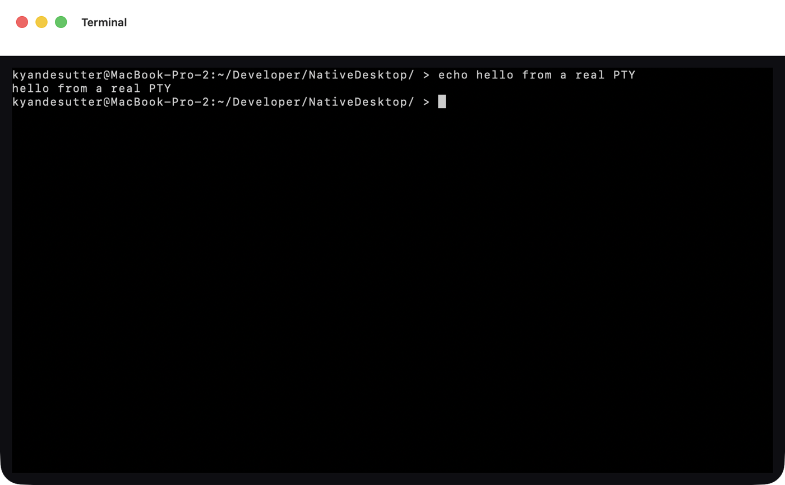
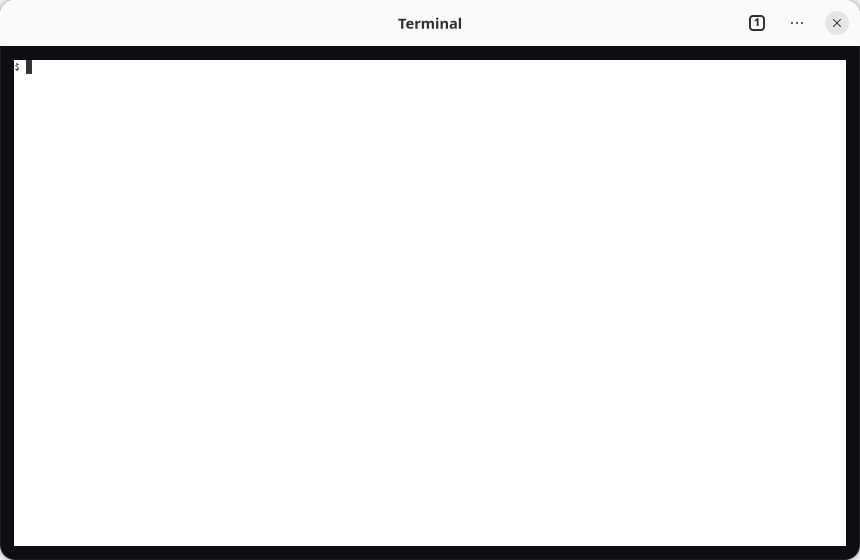

`<terminal>` embeds a real terminal emulator as a native drawing surface: `libghostty-vt`, the same
VT engine that powers [Ghostty](https://ghostty.org). It spawns a PTY running your shell, parses the
escape-sequence stream into a cell grid, and draws that grid with the platform's own text stack:
CoreText on macOS, cairo and Pango on GTK. The surface captures keystrokes and writes them straight to
the PTY.





```tsx
import { render } from "@nativedesktop/react";

function App() {
  return (
    <window title="Terminal" defaultWidth={720} defaultHeight={460}>
      <terminal cols={80} rows={24} fontSize={13} />
    </window>
  );
}

await render(<App />);
```

That is a complete, working terminal with no native code in your app: you can type at the shell
prompt, run `vim`, and see colors and the cursor.

## Props

| Prop       | Type     | Default   | Notes                                                        |
| ---------- | -------- | --------- | ------------------------------------------------------------ |
| `command`  | string   | `$SHELL`  | Program to run in the PTY. Falls back to `/bin/sh`.          |
| `cwd`      | string   | inherited | Working directory for the spawned program.                  |
| `fontSize` | number   | `13`      | Point size of the monospace cell font.                      |
| `cols`     | number   | `80`      | Initial columns.                                             |
| `rows`     | number   | `24`      | Initial rows.                                                |

All props are `create`-time. The terminal owns its PTY for the life of the widget, so changing them
means remounting, which you do by giving the widget a different `key`. Keystrokes are handled host-side in the
surface and fed directly to the PTY; they never cross the NDP protocol, which keeps the interactive
hot path off the socket entirely.

## How it works

The design mirrors Ghostty's own split of a shared terminal core from a per-platform app runtime,
which maps cleanly onto NativeDesktop's two backends:

- **`libghostty-vt`** is terminal emulation only: it parses the VT stream and maintains the grid,
  scrollback, cursor, colors, and reflow. It does not spawn a PTY, render, or touch OS input.
- **The `ndterm` core** (`src/core/terminal.zig`, GTK-free) owns those three: it runs `forkpty`,
  pumps the PTY into `libghostty-vt` on a reader thread behind a mutex, and exposes a tiny C ABI
  (`include/ndterm.h`) that hides the emulator behind a flat, cross-language surface:
  `ndterm_open`/`close`/`resize`, `ndterm_write_input(bytes)`, and a lock-snapshot render
  model (`ndterm_render_lock` → `ndterm_cell(x, y)` / `ndterm_cursor` → `ndterm_render_unlock`).
- **The surface** is the only per-backend piece: a `GtkDrawingArea` painting cells with cairo on
  Linux, an `NSView` painting with CoreText on macOS. Both call only the `ndterm` C ABI; neither
  touches `libghostty-vt` directly.

This is the same native escape-hatch pattern the widget system describes as its last rung: a
widget that owns a custom-drawn native subtree instead of composing from primitives. The terminal is
the first widget built on it.

## The engine is vendored, not fetched

`libghostty-vt` ships as a prebuilt static library under `vendor/libghostty-vt/` (built once with the
Zig 0.15 toolchain it targets, then linked as a plain C archive so it is independent of the repo's
pinned Zig 0.16). The GTK host links it into every artifact that compiles the terminal surface; the
macOS shell links it after `libnd` so its `ghostty_*` symbols resolve. Nothing is downloaded at build
or run time.

## Remote mode

With `remote`, the widget spawns no PTY. The host process dials a byte-lane TCP server itself and
feeds the terminal from that stream, so raw bytes never cross the app's JS bridge:

```tsx
<terminal remote host="127.0.0.1" port={4618} sessionId={id} ticket={ticket} />
```

`host`, `port`, `sessionId`, and `ticket` are create-time props like everything else on the widget:
to attach with a different ticket or session, remount with a different `key`.

Connection sharing is keyed by `host:port:ticket`. Terminals opened with the same ticket share one
TCP connection (the server assigns each an attach channel); a different ticket always gets its own
connection and reader thread, even to the same endpoint. Servers that mint single-use,
session-scoped tickets rely on this: a stale or failed connection for an endpoint never blocks a
fresh attach, and one terminal's grant never limits another's.

The connection auto-reconnects with backoff and replays its ticket on each attempt. Progress is
reported through `onConnectionState` (`data.state` indexes `connecting`, `authed`, `attached`,
`reconnecting`, `failed`, `closed`, the `nd_rt_state` order in `include/ndremote.h`). `failed` is
terminal for that connection: the server refused auth or attach, so retrying the same ticket cannot
succeed. Apps recover by minting a fresh ticket and remounting, which creates a fresh connection
under the new key.

## Current scope

The terminal renders the grid and routes keyboard input on both backends. Terminal-initiated events
back to React (title changes, bell, child exit) are not exposed yet: the core already raises them
internally, but the `onTitle`/`onBell`/`onExit` handlers that would surface them are a follow-up.
Mouse reporting, IME/dead-key composition, and live font-size changes are also future work.
