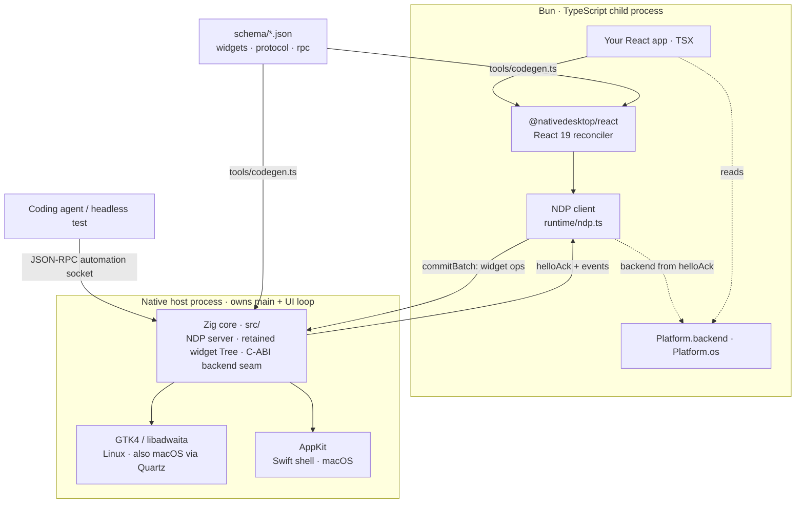

Every app runs as two processes. Your React code runs in a Bun/TypeScript child; the native widgets
live in a host process that owns `main()` and the platform's UI loop. They talk over NDP, a
length-prefixed frame protocol on a local socket, encoded as JSON or as a binary format negotiated
at handshake. A JavaScript crash or hang cannot take the window down: the host stays up and keeps
answering automation requests.

## The child

Your components render into a React 19 tree, and the reconciler (`@nativedesktop/react`) never
mutates a widget directly. Each commit is diffed into a `CommitBatch`, a list of structural ops
(`create`, `append`, `update`, `setText`), and sent to the host as one NDP frame. Events like
`onClick` and `onChanged` come back keyed by node id and dispatch into your handlers. The child is
plain Bun, so the full `process` API is available, which is how `Platform.os` reads
`process.platform`.

## The host: one core, two backends

The native side is a shared Zig core (`src/`) with a pluggable backend seam, embedded by two
different hosts. The core owns the NDP server, the authoritative retained widget tree, and a frozen
C-ABI vtable (`include/nd.h`). Each embedder fills that vtable with real widgets.

The GTK4 and libadwaita backend compiles into the `nd-hello` Zig binary. It also runs on macOS
through GTK's Quartz `gdk` backend, which keeps GTK-side changes verifiable on a Mac. The AppKit
backend is a thin Swift shell (`swift/Sources/NDShell/`) that links the same GTK-free core as a
static library (`libnd.a`) and registers its vtable through `nd_register_backend`.

Both send an identical handshake and speak identical NDP, since handshake and transport live in the
shared core. Only widget creation and prop application differ.

## Which backend is drawing

The OS cannot answer that. GTK runs on macOS too, so `process.platform === "darwin"` does not imply
AppKit. The host names its active backend in the `helloAck` frame: the core learns the name from the
embedder through `nd_set_backend_name`, called before `nd_start_runtime` (`"gtk"` from the GTK host,
`"appkit"` from the Swift host), and echoes it back. The child's renderer stashes it before your
tree mounts and exposes it as `Platform.backend`. See
[Platform Support](/native-platform/platform-support/).

## The automation socket

Separately from NDP, the host answers a JSON-RPC automation socket whenever `NATIVE_AUTOMATION=1` is
set. Every widget the React tree creates is tracked host-side and queryable through `getTree`,
`click`, `setValue`, `waitFor`, and `screenshot`, so a coding agent or headless test drives the app
the way a user does.

## Schemas are the single source of truth

Three JSON schemas (`schema/widgets.json`, `schema/protocol.json`, `schema/rpc.json`) feed
`tools/codegen.ts`, which emits both sides of every boundary: the Zig structs in `src/generated/`,
the TypeScript types in `packages/react/src/generated/`, the Swift bindings, and the widget docs.
Rename or retype a field and both sides fail to compile at once instead of producing a silent wire
mismatch.
