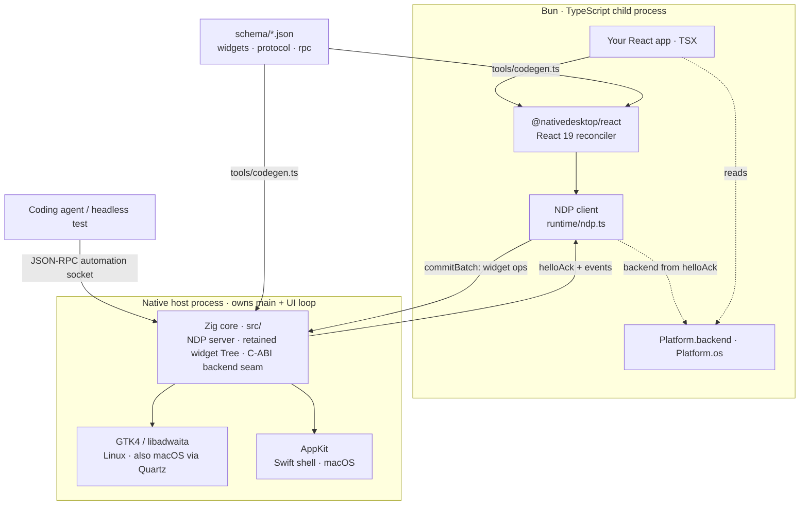

Every NativeDesktop app runs as **two processes**. Your React code runs in a Bun/TypeScript
child; the native widgets live in a separate host process that owns `main()` and the platform's
UI loop. They talk over **NDP** — a length-prefixed frame protocol (JSON, or a binary encoding
negotiated at handshake) over a local socket. Because they're separate processes, a JavaScript
crash or hang can't take the window down: the host stays up and keeps answering automation requests.

## The child: React that never touches a widget

Your components render into a React 19 tree, but the reconciler
(`@nativedesktop/react`) never mutates a widget directly. Each commit is diffed into a
`CommitBatch` — a list of structural ops (`create`, `append`, `update`, `setText`, …) — and sent
to the host as one NDP frame. Events (`onClick`, `onChanged`) travel back the other way, keyed by
node id, and dispatch into your handlers. The child is just Bun, so the full `process` API is
available — which is how `Platform.os` reads `process.platform`.

## The host: one Zig core, two backends

The native side is not one binary but a **shared Zig core** (`src/`) with a pluggable backend
seam. The core owns the NDP server, the authoritative retained widget tree, and a frozen C-ABI
vtable (`include/nd.h`). Two embedders fill that vtable with real widgets:

- **GTK4 + libadwaita** — the Linux backend, compiled into the `nd-hello` Zig binary. It also runs
  on macOS through GTK's Quartz `gdk` backend, which is how GTK-side changes stay verifiable on a
  Mac.
- **AppKit** — a thin Swift shell (`swift/Sources/NDShell/`) that links the same GTK-free core as
  a static library (`libnd.a`) and registers its vtable via `nd_register_backend`.

Both routes send the identical handshake and speak identical NDP, because the handshake and
transport live entirely in the shared core — only widget creation and prop application differ per
backend.

## Which backend am I in? — the handshake

The OS alone can't answer that: GTK runs on macOS too, so `process.platform === "darwin"` does not
imply AppKit. The authoritative answer comes from the host, which names its active backend in the
**helloAck** frame. The core learns that name from the embedder (`nd_set_backend_name`, called
before `nd_start_runtime` — `"gtk"` from the GTK host, `"appkit"` from the Swift host) and echoes
it back. The child's renderer stashes it before your tree mounts and exposes it as
`Platform.backend`. See [Platform Support](/native-platform/platform-support/) for the API.

## The automation socket

Separately from NDP, the host answers a **JSON-RPC automation socket** whenever
`NATIVE_AUTOMATION=1` is set. Every widget the React tree creates is tracked host-side and
queryable — `getTree`, `click`, `setValue`, `waitFor`, `screenshot` — so a coding agent or headless
test drives the app the same way a user would, not through a bolted-on test layer.

## Schemas are the single source of truth

Three JSON schemas (`schema/widgets.json`, `schema/protocol.json`, `schema/rpc.json`) feed
`tools/codegen.ts`, which emits both sides of every boundary: the Zig structs in `src/generated/`,
the TypeScript types in `packages/react/src/generated/`, the Swift bindings, and the widget docs.
Renaming or retyping a field is a compile error on both sides at once, never a silent wire
mismatch.
