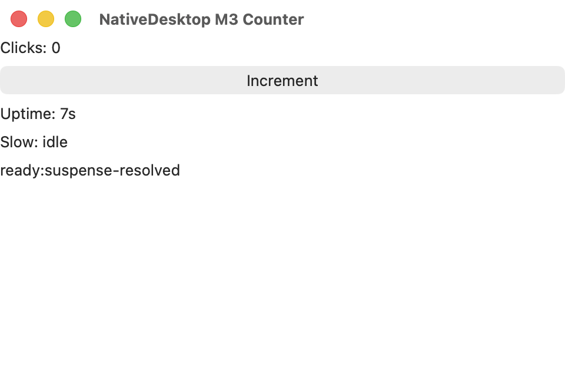
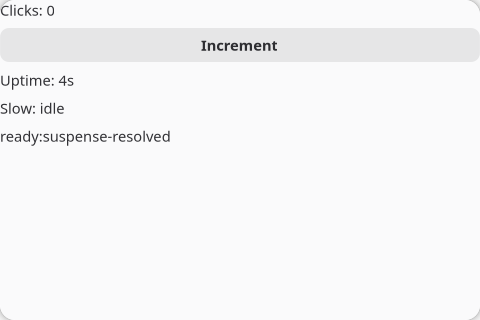

You build a counter with increment and decrement buttons, a derived status line, and platform-native
button styling. Along the way you meet the four widgets every app starts with: `<window>`, `<box>`,
`<label>`, and `<button>`.

**Prerequisites**: a project from the [Quick Start](/get-started/quick-start/). The code goes in
`src/main.tsx`.

## 1. Create the window

Start with a static window:

```tsx
import { render } from "@nativedesktop/react";

function Counter() {
  return (
    <window title="Counter" defaultWidth={480} defaultHeight={320}>
      <box orientation="vertical" spacing={8}>
        <label text="Count: 0" />
      </box>
    </window>
  );
}

await render(<Counter />);
```

A `<window>` is the root of the tree. `<box>` is the layout primitive: it stacks children
vertically or horizontally, and its `spacing` defaults to the platform's standard gap when you omit
it. `<label>` renders text through a real native text widget.

## 2. Add state

Wire the count to `useState` and add a button:

```tsx
import { render, useState } from "@nativedesktop/react";

function Counter() {
  const [count, setCount] = useState(0);

  return (
    <window title="Counter" defaultWidth={480} defaultHeight={320}>
      <box orientation="vertical" spacing={8}>
        <label text={`Count: ${count}`} />
        <button label="Increment" onClick={() => setCount((c) => c + 1)} />
      </box>
    </window>
  );
}

await render(<Counter />);
```

The hook comes from `@nativedesktop/react`, not `react`. That is the one import rule in
NativeDesktop; it keeps hooks working across hot reloads
([why](/core-concepts/state-hot-reload/)).

Clicking the button fires a native click event in the host process. It crosses the socket to your
React process, runs your handler, and the resulting commit crosses back. You never notice the trip.

## 3. Derive, don't store

Values computed from state are computed inline, not stored in more state. Add a parity line under
the count:

```tsx
const parity = count % 2 === 0 ? "even" : "odd";
```

```tsx
<label text={`Count: ${count}`} />
<label text={`That is ${parity}.`} cssClasses={["dimmed"]} />
```

`cssClasses` is the styling escape hatch into each platform's design language. The names come from
libadwaita's vocabulary; on macOS they map onto real AppKit control properties. `dimmed` renders
secondary text the way each platform dims it.

## 4. Style the buttons

Add a decrement button and group both in a horizontal box:

```tsx
<box orientation="horizontal" spacing={8} style={{ halign: "center" }}>
  <button label="Decrement" onClick={() => setCount((c) => c - 1)} />
  <button
    label="Increment"
    onClick={() => setCount((c) => c + 1)}
    cssClasses={["suggested-action"]}
  />
</box>
```

`suggested-action` marks the primary action: the accent-colored button on GNOME, the default button
treatment on macOS. `style` is not CSS; it covers theme-neutral geometry and alignment like
`halign`.

The finished file:

```tsx
import { render, useState } from "@nativedesktop/react";

function Counter() {
  const [count, setCount] = useState(0);
  const parity = count % 2 === 0 ? "even" : "odd";

  return (
    <window title="Counter" defaultWidth={480} defaultHeight={320}>
      <box orientation="vertical" spacing={8}>
        <label text={`Count: ${count}`} />
        <label text={`That is ${parity}.`} cssClasses={["dimmed"]} />
        <box orientation="horizontal" spacing={8} style={{ halign: "center" }}>
          <button label="Decrement" onClick={() => setCount((c) => c - 1)} />
          <button
            label="Increment"
            onClick={() => setCount((c) => c + 1)}
            cssClasses={["suggested-action"]}
          />
        </box>
      </box>
    </window>
  );
}

await render(<Counter />);
```

## Run it

```bash
bun run dev
```

The same file renders in each platform's own design language:





Leave it running and edit the parity strings. The window updates in place and the count survives
the edit.

## Where to go next

- [Build a Settings Window](/get-started/tutorial-settings/): sidebar navigation, settings rows, persistence, and dialogs.
- [Styling & Design Language](/core-concepts/styling-design-language/): the full `cssClasses` vocabulary and what `style` covers.
