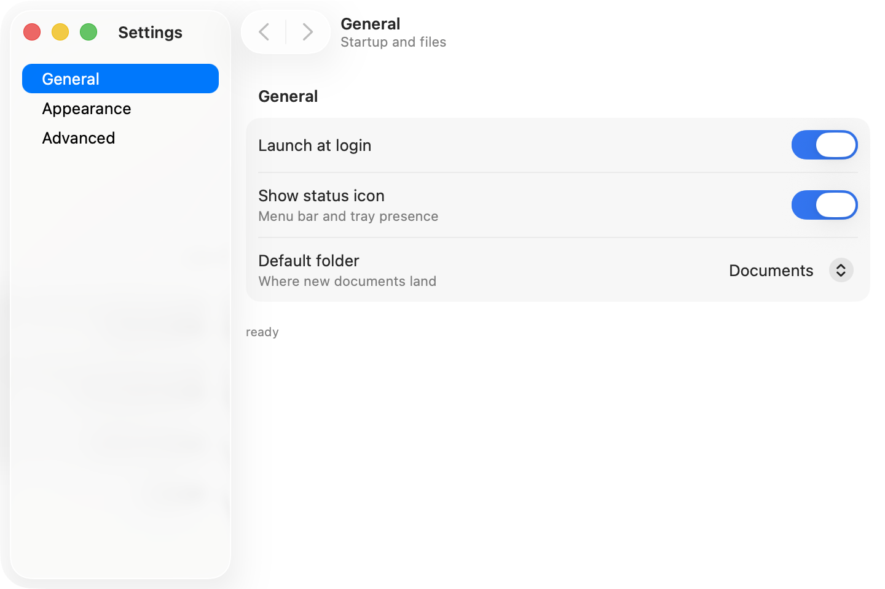
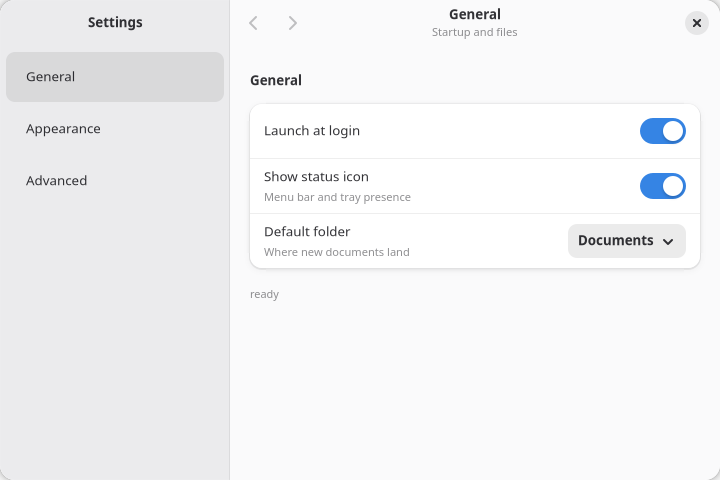

You build a two-page settings window: a sidebar that switches pages, native settings rows with
switches and sliders, values that persist across launches, and a native confirmation dialog on the
reset button.

**Prerequisites**: a project from the [Quick Start](/get-started/quick-start/) and the
[Counter tutorial](/get-started/tutorial-counter/). The code goes in `src/main.tsx`.

## 1. Split the window

Settings windows are a sidebar plus a content pane. `<splitview>` is the real native split
(`NSSplitView` on macOS, `AdwOverlaySplitView` on GNOME), and each pane carries its own header via
`<toolbarview>`:

```tsx
import { render, useState } from "@nativedesktop/react";

const pages = [
  { id: "general", label: "General", blurb: "Startup and status" },
  { id: "appearance", label: "Appearance", blurb: "Theme and text" },
] as const;

function App() {
  const [pageIndex, setPageIndex] = useState(0);
  const page = pages[pageIndex] ?? pages[0];

  return (
    <window title="Settings" defaultWidth={720} defaultHeight={480}>
      <splitview sidebarWidth={0.32} breakpoint={480}>
        <toolbarview slot="sidebar">
          <headerbar title="Settings" />
          <sourcelist
            items={pages.map((p) => ({ title: p.label }))}
            selectedIndex={pageIndex}
            onSelectionChanged={(e) => setPageIndex(e.index)}
            style={{ vexpand: true }}
          />
        </toolbarview>
        <toolbarview slot="content">
          <headerbar title={page.label} subtitle={page.blurb} />
          <label text={`The ${page.label} page`} style={{ vexpand: true }} />
        </toolbarview>
      </splitview>
    </window>
  );
}

await render(<App />);
```

Three things to notice:

- `<sourcelist>` is the platform's navigation list, with controlled selection:
  `selectedIndex` in, `onSelectionChanged` out.
- `breakpoint={480}` collapses the sidebar automatically when the window gets narrower than 480
  points.
- `<headerbar title subtitle>` on the content pane: both update in place, so the header follows the
  selected page with no `key` and no remount.

Run `bun run dev` and click between the pages.

## 2. Add settings rows

Replace the content placeholder with real settings chrome: `<settingsgroup>` renders a titled group
of rows (`AdwPreferencesGroup` on GNOME, the grouped settings style on macOS), and `<switchrow>` is
a row with a built-in toggle. `<clamp>` caps the content width so rows do not stretch across a wide
window.

Add the settings shape and state above `App`:

```tsx
interface Settings {
  launchAtLogin: boolean;
  showStatusIcon: boolean;
  themeIndex: number;
  textSize: number;
}

const defaults: Settings = {
  launchAtLogin: false,
  showStatusIcon: true,
  themeIndex: 0,
  textSize: 14,
};
```

Inside `App`, hold the settings in state with one typed updater:

```tsx
const [settings, setSettings] = useState<Settings>(defaults);

function set<K extends keyof Settings>(key: K, value: Settings[K]) {
  setSettings((prev) => ({ ...prev, [key]: value }));
}
```

Then swap the content pane's `<label>` for the General page:

```tsx
<scrollview minContentHeight={380} style={{ vexpand: true }}>
  <clamp maximumSize={560}>
    <box
      orientation="vertical"
      spacing={18}
      style={{ hexpand: true, padding: { top: 18, bottom: 18, left: 12, right: 12 } }}
    >
      {page.id === "general" && (
        <settingsgroup title="General">
          <switchrow
            title="Launch at login"
            checked={settings.launchAtLogin}
            onToggled={(e) => set("launchAtLogin", e.checked)}
          />
          <switchrow
            title="Show status icon"
            subtitle="Menu bar and tray presence"
            checked={settings.showStatusIcon}
            onToggled={(e) => set("showStatusIcon", e.checked)}
          />
        </settingsgroup>
      )}
    </box>
  </clamp>
</scrollview>
```

## 3. Fill the Appearance page

A plain `<row>` carries a title and an optional subtitle, and places any child widget in its
trailing slot. Add the Appearance page next to the General block:

```tsx
{page.id === "appearance" && (
  <settingsgroup title="Appearance" description="Changes apply immediately.">
    <row title="Theme">
      <select
        options={themes}
        selectedIndex={settings.themeIndex}
        onSelectionChanged={(e) => set("themeIndex", e.index)}
      />
    </row>
    <row title="Text size" subtitle={`${Math.round(settings.textSize)}pt`}>
      <slider
        min={10}
        max={24}
        step={1}
        value={settings.textSize}
        onValueChanged={(e) => set("textSize", e.value)}
        style={{ hexpand: true }}
      />
    </row>
  </settingsgroup>
)}
```

with the options at module scope:

```tsx
const themes = ["System", "Light", "Dark"];
```

`hexpand` on the slider propagates into the row's trailing area, so the track gets usable width.
GNOME's own settings sliders do the same.

## 4. Persist with createStore

Right now every launch starts from defaults. `createStore` gives you a versioned JSON file under
the app's data directory, with debounced, crash-safe writes and a flush on exit.

Replace the `useState` with a store at module scope:

```tsx
import { createStore, render, useState, useStoreValue } from "@nativedesktop/react";

const store = createStore<Settings>({ name: "settings", version: 1, defaults });
```

Inside `App`, read it with `useStoreValue` and write through the store:

```tsx
const settings = useStoreValue(store);

function set<K extends keyof Settings>(key: K, value: Settings[K]) {
  store.update((prev) => ({ ...prev, [key]: value }));
}
```

Load it once, before rendering:

```tsx
await store.load();
await render(<App />);
```

Loading before `render()` makes `store.get()` synchronous inside components: no loading flash, no
restore effect. The file lands at `settings.json` under the app data dir, which is
`~/Library/Application Support/<name>` on macOS and `~/.local/share/<name>` on Linux, where
`<name>` comes from your `package.json`. When you later change the shape, bump `version` and add a
`migrate` hook; it runs on every load and returns the upgraded value, or `null` to reset.

Toggle a switch, quit, and run again. The values come back.

## 5. Confirm the reset with a native dialog

Dialog helpers are promise-wrapped commands on a `<window>`. They need two pieces of wiring: a ref
to the window node, and the window's `onAlertResult` prop routed back into the helper so the
promise can settle.

```tsx
import {
  createStore,
  onAlertResult,
  render,
  showAlert,
  useRef,
  useState,
  useStoreValue,
} from "@nativedesktop/react";
import type { NdNodeRef } from "@nativedesktop/react";
```

```tsx
const winRef = useRef<NdNodeRef<"window">>(null);

async function confirmReset() {
  const win = winRef.current;
  if (!win) return;
  const result = await showAlert(win, {
    title: "Reset all settings?",
    body: "Every option returns to its default value.",
    buttons: [
      { id: "cancel", label: "Cancel" },
      { id: "reset", label: "Reset", style: "destructive" },
    ],
  });
  if (result.buttonId === "reset") store.set(defaults);
}
```

```tsx
<window
  ref={winRef}
  title="Settings"
  defaultWidth={720}
  defaultHeight={480}
  onAlertResult={(e) => onAlertResult(winRef.current!, e)}
>
```

And the button, after the two page blocks:

```tsx
<button
  label="Reset All Settings"
  onClick={confirmReset}
  cssClasses={["destructive-action"]}
  style={{ halign: "start" }}
/>
```

`showAlert` shows a real native sheet (`NSAlert` on macOS, `AdwAlertDialog` on GNOME) and resolves
with the id of the clicked button. One dialog per window can be pending at a time; a second call
while one is open rejects instead of queueing.

## Run it

```bash
bun run dev
```





The finished file:

```tsx
import {
  createStore,
  onAlertResult,
  render,
  showAlert,
  useRef,
  useState,
  useStoreValue,
} from "@nativedesktop/react";
import type { NdNodeRef } from "@nativedesktop/react";

interface Settings {
  launchAtLogin: boolean;
  showStatusIcon: boolean;
  themeIndex: number;
  textSize: number;
}

const defaults: Settings = {
  launchAtLogin: false,
  showStatusIcon: true,
  themeIndex: 0,
  textSize: 14,
};

const store = createStore<Settings>({ name: "settings", version: 1, defaults });

const pages = [
  { id: "general", label: "General", blurb: "Startup and status" },
  { id: "appearance", label: "Appearance", blurb: "Theme and text" },
] as const;

const themes = ["System", "Light", "Dark"];

function App() {
  const settings = useStoreValue(store);
  const [pageIndex, setPageIndex] = useState(0);
  const winRef = useRef<NdNodeRef<"window">>(null);
  const page = pages[pageIndex] ?? pages[0];

  function set<K extends keyof Settings>(key: K, value: Settings[K]) {
    store.update((prev) => ({ ...prev, [key]: value }));
  }

  async function confirmReset() {
    const win = winRef.current;
    if (!win) return;
    const result = await showAlert(win, {
      title: "Reset all settings?",
      body: "Every option returns to its default value.",
      buttons: [
        { id: "cancel", label: "Cancel" },
        { id: "reset", label: "Reset", style: "destructive" },
      ],
    });
    if (result.buttonId === "reset") store.set(defaults);
  }

  return (
    <window
      ref={winRef}
      title="Settings"
      defaultWidth={720}
      defaultHeight={480}
      onAlertResult={(e) => onAlertResult(winRef.current!, e)}
    >
      <splitview sidebarWidth={0.32} breakpoint={480}>
        <toolbarview slot="sidebar">
          <headerbar title="Settings" />
          <sourcelist
            items={pages.map((p) => ({ title: p.label }))}
            selectedIndex={pageIndex}
            onSelectionChanged={(e) => setPageIndex(e.index)}
            style={{ vexpand: true }}
          />
        </toolbarview>

        <toolbarview slot="content">
          <headerbar title={page.label} subtitle={page.blurb} />
          <scrollview minContentHeight={380} style={{ vexpand: true }}>
            <clamp maximumSize={560}>
              <box
                orientation="vertical"
                spacing={18}
                style={{ hexpand: true, padding: { top: 18, bottom: 18, left: 12, right: 12 } }}
              >
                {page.id === "general" && (
                  <settingsgroup title="General">
                    <switchrow
                      title="Launch at login"
                      checked={settings.launchAtLogin}
                      onToggled={(e) => set("launchAtLogin", e.checked)}
                    />
                    <switchrow
                      title="Show status icon"
                      subtitle="Menu bar and tray presence"
                      checked={settings.showStatusIcon}
                      onToggled={(e) => set("showStatusIcon", e.checked)}
                    />
                  </settingsgroup>
                )}

                {page.id === "appearance" && (
                  <settingsgroup title="Appearance" description="Changes apply immediately.">
                    <row title="Theme">
                      <select
                        options={themes}
                        selectedIndex={settings.themeIndex}
                        onSelectionChanged={(e) => set("themeIndex", e.index)}
                      />
                    </row>
                    <row title="Text size" subtitle={`${Math.round(settings.textSize)}pt`}>
                      <slider
                        min={10}
                        max={24}
                        step={1}
                        value={settings.textSize}
                        onValueChanged={(e) => set("textSize", e.value)}
                        style={{ hexpand: true }}
                      />
                    </row>
                  </settingsgroup>
                )}

                <button
                  label="Reset All Settings"
                  onClick={confirmReset}
                  cssClasses={["destructive-action"]}
                  style={{ halign: "start" }}
                />
              </box>
            </clamp>
          </scrollview>
        </toolbarview>
      </splitview>
    </window>
  );
}

await store.load();
await render(<App />);
```

## Where to go next

- [Build a Tabbed Terminal](/get-started/tutorial-terminal/): the `<terminal>` widget and native system tabs.
- [App Data & Storage](/core-concepts/app-data-storage/): the store API in full, plus worker-backed SQLite.
- [Dialogs](/components/dialogs/): file pickers, save dialogs, and the About panel.
