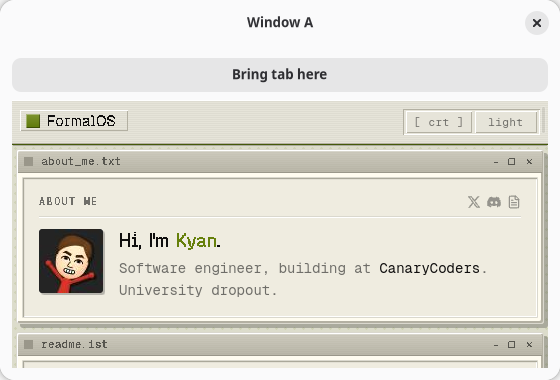

Render multiple `<window>` roots, typically as siblings inside a fragment, and each becomes an
independent OS window on both backends, all driven by the same Bun/React process. Windows sharing a
`tabGroup` prop render as one tabbed window instead; see [Native Tabs](/native-platform/tabs/).
`examples/multiwindow/main.tsx` is the reference app for this page.




## Rendering more than one window

```tsx
import { render } from "@nativedesktop/react";

function App(): React.ReactNode {
  return (
    <>
      <window title="Window A" defaultWidth={560} defaultHeight={380}>
        {/* … */}
      </window>
      <window title="Window B" defaultWidth={560} defaultHeight={380}>
        {/* … */}
      </window>
    </>
  );
}

await render(<App />);
```

The core reconciler (`src/tree.zig`) pools window handles by node id, so a `--hot` edit rebinds
existing windows instead of reopening them, and a genuinely new `<window>` node opens a fresh OS
window. Every window is rendered by the same tree in one process, so sharing state between them is
ordinary React state and closures. No IPC, unlike a multi-window Electron app where each window is
its own renderer process.

Automation, the crash overlay, window chrome, and the ACL are all per-window correct:

- A node's geometry and visibility, and therefore the bounds `getTree` reports plus `click`,
  `setValue`, `type`, `scroll`, and `waitFor`'s `refVisible` check, resolve against that widget's
  own window rather than a global. GTK uses `gtk_widget_get_root()`; AppKit resolves the live
  content view of `view.window`.
- `screenshot` renders whichever window `params.window` names.
- A JS crash brings down every window's UI at once, so the crash overlay paints on every open
  window and clears on every window on restart.
- Each `<toolbarview>` and headerbar attaches to its own owning `NSWindow`/`GtkWindow`, not
  whichever window was created last.
- `core:window.create` is ACL-gated per target window id, so a grants manifest can scope window
  creation to a specific window. A window-0 grant still applies everywhere, matching the default
  policy.

`getTree` scopes per window too: pass `window` (a Window node ref) and the snapshot covers that
window's subtree. Without it, the RPC returns the root/first window's tree, with every other
window's nodes attached as orphans directly under that root; each orphan's own `geometry` is still
correct, resolved against its own window as above.

## Moving a widget between windows without reloading it

Plain React cannot express this move safely. A node under a new parent is a different position in
the fiber tree, so React unmounts the old instance and mounts a fresh one, which the host turns into
a native destroy and create. For a `<webview>` that throws away the WKWebView/WebKitGTK instance and
rebuilds it: the page reloads and scroll position, form input, and JS state go with it.

Two functions from `@nativedesktop/react` (`packages/react/src/renderer.ts`) work around it:

```ts
function createPool(): Pool
function createPortal(children: ReactNode, pool?: Pool): ReactPortal
function moveNode(node: NdNodeRef, toParent: NdNodeRef, before?: NdNodeRef | null): void
```

- **`createPortal(children, pool?)`** renders `children` into a stable, off-window pool instead
  of wherever it's called from in the tree, but its React fiber stays at that call site. Because the
  fiber's position never changes, React never unmounts it, no matter which window later shows it.
  If you omit `pool`, a single process-lifetime pool shared across the app is used; call
  `createPool()` yourself (once, at module scope or in a ref, never inside render) if you want more
  than one.
- **`moveNode(node, toParent, before?)`** relocates only the live native widget under `toParent`
  (optionally positioned before another node); it never touches the React tree. `node` and
  `toParent` are what a host-element `ref` resolves to (`NdNodeRef`, the same handle
  [Imperative Commands & Refs](/core-concepts/imperative-commands/) uses).

A node rendered via `createPortal` is a live native widget the moment it mounts. It is attached to
no window until the first `moveNode` call places it somewhere visible.

```tsx
import { render, createPortal, moveNode, useEffect, useRef, useState } from "@nativedesktop/react";
import type { NdNodeRef } from "@nativedesktop/react";

function App(): React.ReactNode {
  const tab = useRef<NdNodeRef<"webview">>(null);
  const slotA = useRef<NdNodeRef<"box">>(null);
  const slotB = useRef<NdNodeRef<"box">>(null);
  const [host, setHost] = useState<"A" | "B">("A");

  function show(slot: NdNodeRef<"box"> | null, name: "A" | "B") {
    if (tab.current && slot) {
      moveNode(tab.current, slot);
      setHost(name);
    }
  }

  return (
    <>
      {/* The tab, pinned in the pool. Its React position never changes, so it's
          never unmounted when it moves between windows. */}
      {createPortal(
        <webview ref={tab} url="https://example.com/" style={{ hexpand: true, vexpand: true }} />,
      )}

      <window title="Window A" defaultWidth={560} defaultHeight={380}>
        <box ref={slotA} orientation="vertical" style={{ hexpand: true, vexpand: true }}>
          <button label="Bring tab here" onClick={() => show(slotA.current, "A")} />
          {host !== "A" && <label text="(tab is in Window B)" />}
        </box>
      </window>

      <window title="Window B" defaultWidth={560} defaultHeight={380}>
        <box ref={slotB} orientation="vertical" style={{ hexpand: true, vexpand: true }}>
          <button label="Bring tab here" onClick={() => show(slotB.current, "B")} />
          {host !== "B" && <label text="(tab is in Window A)" />}
        </box>
      </window>
    </>
  );
}

await render(<App />);
```

Render the portal at a stable position (one per movable item, keyed by its own id, at or near the
app root) so it outlives any single window it might currently be showing in.

### Why it is imperative

`moveNode` breaks from the declarative model the rest of the toolkit follows because the thing being
preserved, a widget's live native state, is exactly what React's model would destroy. It rides the
same `widgetCommand` channel as [`sendCommand`](/core-concepts/imperative-commands/) under a
reserved command name, into a `reparent_child` op on the host ABI vtable, so it reaches the native
widget through the same C-ABI seam as every other host operation with no protocol or schema change.
GTK brackets the move in a `g_object_ref`/`unref` pair; AppKit takes a retain across it. Either way
the widget is never transiently deallocated mid-reparent.
