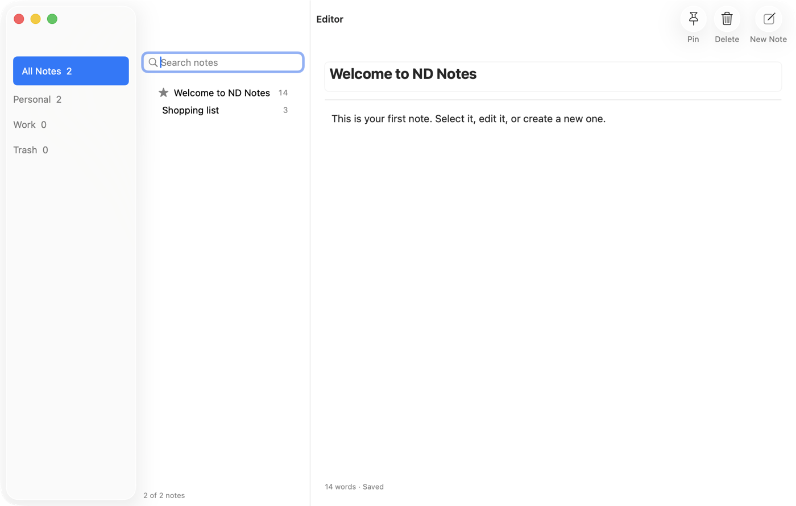
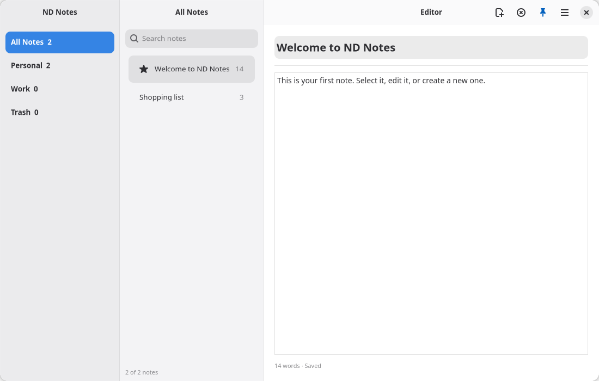

The two-pane sidebar/content `<splitview>` (see [Windows & Chrome](/native-platform/windows-chrome/))
extends to a third pane, `list`, for the folders/list/content shape Notes, Mail, and Files share:
a source list on the left, a filtered list of items in the middle, a detail view on the right.





## Shape

Panes are still distinguished by the `slot` attached prop, now with a third value:

```tsx
<splitview sidebarWidth={0.25} listWidth={0.3}>
  <toolbarview slot="sidebar">
    <headerbar title="Folders" />
    {/* folder rows */}
  </toolbarview>

  <toolbarview slot="list">
    <headerbar title="Notes" />
    {/* list rows */}
  </toolbarview>

  <toolbarview slot="content">
    <headerbar title="Editor" />
    {/* detail pane */}
  </toolbarview>
</splitview>
```

(Adapted from `examples/notes/threepane-probe.tsx`, the headless acceptance fixture.) The `list`
slot is additive: a `<splitview>` with only `sidebar` and `content` children behaves as before.

`sidebarWidth` and the new `listWidth` are both create-only fractions setting each split's initial
proportion; `collapsed` remains live-updatable. See the [Widget Reference](/components/widget-reference/)
for the full prop table.

`breakpoint` (int, pixels, create-only, `0` means off) collapses the sidebar automatically once the
split's own width drops below it, independent of `collapsed`, then restores whatever `collapsed` last
said once the width climbs back past it: GTK via an `AdwBreakpoint` on the split's max-width
condition, AppKit via `NDSplitViewController.applyBreakpoint`, which adds an 8pt hysteresis band
around the threshold so a divider drag or a live resize can't toggle the sidebar on every pixel at
the boundary.

## Platform rendering

### macOS: NSSplitViewController with three items

Each pane becomes an `NSSplitViewItem` on the same `NSSplitViewController` (see
[Windows & Chrome](/native-platform/windows-chrome/) for why that API is what gives the sidebar its
Liquid Glass material):

- `sidebar` → `NSSplitViewItem(sidebarWithViewController:)`, the glass-treated source list.
- `list` → `NSSplitViewItem(contentListWithViewController:)`, a contentList column.
- `content` → a default split item, the detail pane.

The unified `NSToolbar` splits per divider: with three panes there are two
`NSTrackingSeparatorToolbarItem`s, one per divider. Each pane's headerbar items land in their
own section of the one toolbar spanning the window's top edge, the same idiom as the two-pane case.

### GNOME: nested AdwOverlaySplitViews

GTK builds this as two nested `AdwOverlaySplitView`s: the outer split's sidebar is the `sidebar`
pane, and its content is an inner split whose sidebar is the `list` pane and whose content is the
`content` pane. Same nesting GNOME Files uses. Each pane keeps its own `<toolbarview>` and
`<headerbar>`, so you get three independent per-pane headers rather than one shared bar.

## Caveat: initial sizing is floor-dominated on macOS

`sidebarWidth` and `listWidth` set the initial split proportion, but on macOS each pane carries a
hard `minimumThickness`: 180pt for the sidebar item, 240pt for the list (contentList) item. Those
floors win over the fraction whenever the window is narrow enough that the fraction asks for less.
A small `listWidth` such as `0.15` will not render a genuinely narrow list column at typical window
widths. Measure against the 240pt floor before relying on an exact initial pixel width.

## Tiling panes: `PaneTree` / `createPaneTree`

`<splitview>` is the app-frame shape. For user-driven tiling (terminal splits, editor panes,
anything the user splits and closes at will), use `@nativedesktop/panes` (`packages/panes/`): a pure
model plus a component over the existing `<paned>` widget. No new widget, no schema or ABI change.
Each split renders as a real native `GtkPaned` or `NSSplitView` with a draggable divider.

```tsx
import { Show } from "solid-js";
import type { JSX } from "@nativedesktop/react";
import { PaneTree, createPaneTree, seedPanes } from "@nativedesktop/panes";

function Editor(): JSX.Element {
  const panes = createPaneTree(seedPanes([{ file: "notes.md" }]));
  return (
    <PaneTree
      model={panes.model()}
      onChange={panes.setModel}
      renderLeaf={(leaf) => (
        <box orientation="vertical">
          <label text={`${leaf.data.file}${leaf.focused ? " (focused)" : ""}`} />
          <button label="Split" onClick={() => panes.split(leaf.id, "horizontal", { file: "new.md" })} />
          <Show when={!leaf.solo}>
            <button label="Close" onClick={() => panes.close(leaf.id)} />
          </Show>
        </box>
      )}
    />
  );
}
```

The model is a strictly binary tree (`PaneLeaf | PaneSplit`) with pure ops: `splitPane`,
`closePane`, `focusPane`/`focusPaneAt`/`focusNeighbor`, `setPaneRatio`, `updatePane`, `paneLeaves`,
`samePaneShape`, and `migratePanes` for reviving persisted state (garbage in, empty model out).
Every op returns the same reference when nothing changed, which stops the native `positionChanged`
echo after a programmatic ratio write from looping a render and persist cycle. Ratios are clamped to
`[0.05, 0.95]` (`clampPaneRatio`), non-finite input becomes `0.5`, and echoes at or beyond the clamp
bounds are dropped as mid-layout noise, since a settled drag cannot reach them past the backends'
native minimum pane extents.

`createPaneTree` holds the model in a signal (`panes.model()`) and applies every op against the
latest model rather than the committed one, so two ops in one tick, or a split resuming after an
`await`, cannot revert each other. `latest()` reads that model for persistence; it already holds a
write Solid has not flushed yet. `renderLeaf` runs once per leaf mount and owns all per-pane chrome
(focus ring, toolbar); `PaneTree` supplies one expanding `<box>` wrapper per leaf and a context
whose `data`, `focused` and `solo` are reactive getters, so read them where they are used rather
than destructuring them. Leaves and splits are keyed on their node id, so a model op updates the
live widgets in place, and because `orientation` is create-only on both backends a structural
collapse landing a different split at the same position remounts instead of mutating.
`createDock` and `createTiles` follow the same shape for `DockView` and `TilesView`.

Persist the model with [`createStore`](/core-concepts/app-data-storage/): `store.set(panes.latest())`
on change, `flush()` when `samePaneShape` says the change was structural. `examples/panes/` is the
worked example (and the headless acceptance fixture, `scripts/headless-panes.sh`).

## Automation

Three-pane trees expose the same `getTree`/`click` contract as any other widget nesting (see
[Automation Socket](/automation-testing/automation-socket/)). Each pane's rows are ordinary nodes
at their real geometry, so an automation script can assert x-order across panes (a sidebar row
sits left of a list row, which sits left of the content pane) the same way it would for the
two-pane layout.
